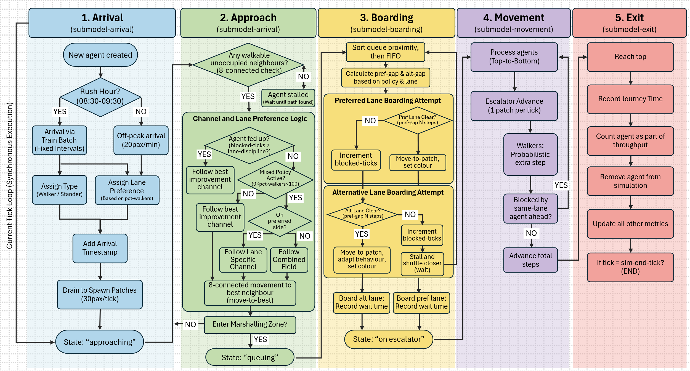
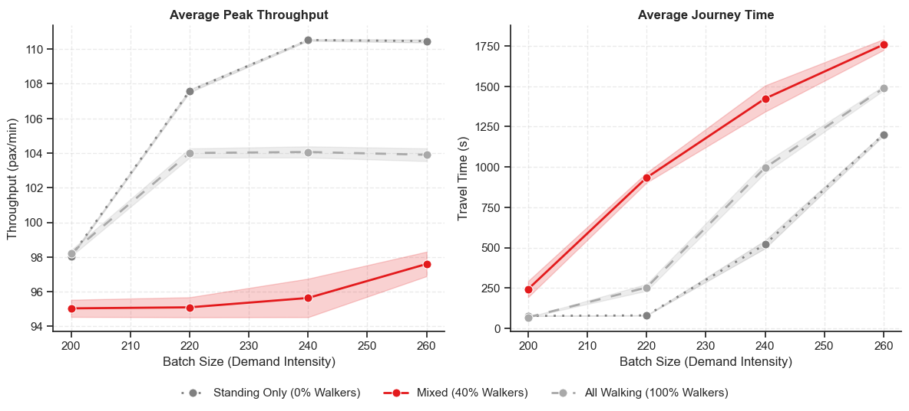
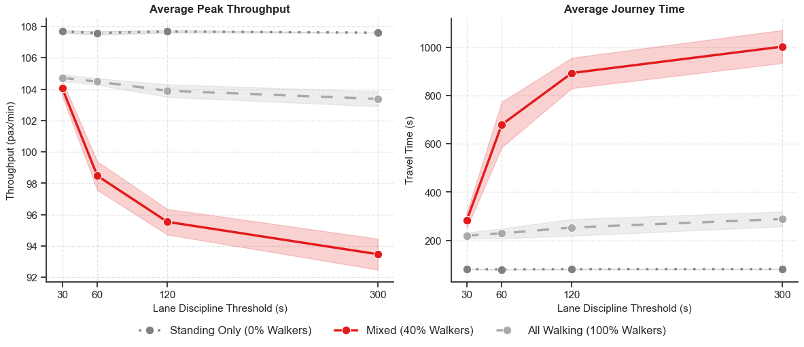

## Background

In 2016, Transport for London introduced a series of initiatives to reduce station crowding and improve safety on the Underground's escalators. One of the more contentious was a trial at Holborn station. On selected escalators, walking was prohibited and passengers were asked to stand on both sides instead.

The reaction was not warm. The policy was described as "terrible", "loopy", "crap" and a "very bad idea". Surely removing the option to walk would make things slower, not faster?

It didn't. During rush hour, the trial found that *16,220 people* could travel on Holborn's 23.4m escalators under a standing-only regime, compared with *12,745* on escalators split between walkers and standers. Roughly a 30% improvement, achieved by asking people to do less.

The explanation lies in "escalator etiquette", the deeply ingrained London convention of standing on the right and walking on the left. For the individual, this works well as those willing to walk move through the station faster than they otherwise would. But during peak periods the convention creates a structural imbalance. Queues build up at the foot of the escalator waiting to join the right-hand standing lane, while the left-hand walking lane runs well below capacity. The result is inefficient queueing, longer waits for the majority, and in some cases genuinely dangerous crowd dynamics in the concourse below.

**So what actually drives this phenomenon, and why does *encouraging standing* yield higher throughput?**

## The Problem

Aggregate queueing models struggle with such questions, because the paradox is not a property of the escalator but a property of how individuals behave on it. The mechanism lives at the level of the person deciding which lane to join and how long to tolerate waiting before giving up on their preference.

Agent-based modelling is well-suited to study this. By treating individuals as autonomous "agents" following specific assigned rules, ABMs can be used to study bottom-up urban dynamics, pedestrian crowds, and the emergent patterns that arise from many simple interactions. Nobody in the system is behaving irrationally, yet the collective outcome is worse than it needs to be, a micro–macro disconnect of the kind Schelling (1971) made famous.

This project seeks to reproduce the empirical patterns observed in the Holborn escalator paradox and, in doing so, to better understand the reasons behind these crowd dynamics and provide insight into improved crowd management. 

## Model Description

The model is documented below following a partial ODD (Overview, Design concepts, Details) protocol, the standard reporting convention for agent-based models.  

### Purpose and Patterns

The model investigates the Holborn escalator paradox: the counterintuitive finding that prohibiting walking on escalators increases overall throughput during peak hour.

The primary research question is:

> **How does the proportion of walking versus standing commuters affect escalator throughput, and under what conditions does a standing-only policy outperform a mixed-behaviour regime?**

Two subsidiary questions follow from it:

1. How does the ratio of walking to standing commuters affect total throughput (passengers per minute)?
2. How does lane-switching discipline affect performance during periods of congestion?

The model is evaluated on its ability to reproduce two empirical patterns. The first is **throughput inversion**, documented during TfL's 2015–2016 standing trial at Holborn, where a standing-only policy on a long escalator increased capacity by approximately 30% during peak hours. The second is **queue formation asymmetry**, where queues form disproportionately in the waiting area because of limited lane availability, while the walking lane retains unused capacity.
  

### Entities, State Variables, and Scales

**Entities.** Two entity types populate the model. *Commuters* (turtles) represent travellers arriving via the Underground. The *environment* (patches) mirrors station infrastructure, with patch types covering spawn (entrance), concourse (waiting area), marshalling area (where agents jostle to board), escalator steps, and an exit zone.

**Agent state variables.**

| Variable | Type/Range | Description |
|---|---|---|
| `walk-preference` | [0, 1] | Base probability of preference to walk or stand on the escalator |
| `is-walking?` | Boolean | Current behaviour state: walking or standing |
| `walk-speed` | [0, 1] | Actualised probability of taking an extra step per tick. 0 for standers; inherits `walk-probability` for walkers |
| `walk-probability` | [0, 100] | Global parameter defining the "cadence" of walkers — the likelihood a walker moves an additional patch beyond the escalator's mechanical movement in a single tick |
| `preferred-lane-x` | Integer {0, 1} | x-coordinate of the agent's target lane. 0 for Left (Standing), 1 for Right (Walking) |
| `blocked-ticks` | Integer ≥ 0 | Consecutive ticks the agent has been unable to advance; triggers lane-switching via the lane-discipline threshold |
| `arrival-tick` | Integer ≥ 0 | Tick at which the agent joined the demand pool, used to calculate total station time |
| `agent-state` | String | "approaching" \| "queueing" \| "on-escalator" |

: {tbl-colwidths="[20,15,65]"}

**Patch state variables.**

| Variable | Type/Range | Description |
|---|---|---|
| `patch-type` | String | "escalator-left" \| "escalator-right" \| "boundary-rails" \| "concourse" \| "marshalling" \| "background" \| "exit-zone" \| "spawn" |
| `is-step?` | Boolean | True if the patch is part of the escalator belt; used to validate movement logic |
| `step-number` | Integer ≥ 0 | Vertical index (0–59) of the step relative to `escalator-bottom-y` |
| `dist-to-escalator` | Integer ≥ 0 | Dijkstra cost value calculated during setup; shortest path distance to the escalator entrance |
| `path-selected?` | Boolean | Temporary flag used during Dijkstra computation to track visited patches |

: {tbl-colwidths="[20,15,65]"}

**Scales.** Each patch represents ~0.4 metres, the depth of a standard escalator step, and each tick corresponds to 0.533 seconds. These are not arbitrary: they are chosen so that the escalator advances exactly **1 patch per tick**, equivalent to **0.75 m/s** — the standard operating speed for London Underground escalators.

Behavioural speed then emerges on top of this mechanical baseline. Walkers attempt one probabilistic extra step per tick, so an agent at 100% `walk-probability` moves 2 patches per tick (1.5 m/s), while one at 50% averages 1.5 patches per tick (1.13 m/s). This stochastic treatment allows small random variations in movement, better reflecting real variation in human movement than a fixed walking speed.

### Process Overview and Scheduling

The simulation runs for 13,560 ticks - 120 minutes at 113 ticks/min. It comprises a 30-minute warm-up, a 60-minute rush hour (08:30–09:30), and a 30-minute cool-down. Five submodels execute sequentially each tick:

1. **Arrival** (`submodel-arrival`). During rush hour, commuters arrive via train batch into a demand pool at fixed intervals, then drain into spawn patches at 30 pax/tick to model platform exit bottlenecks. Each agent is assigned a walker/stander type and preferred lane based on `pct-walkers`, and receives an arrival timestamp used to calculate end-to-end wait time. Off-peak, agents arrive at 20 per minute.
2. **Approach** (`submodel-approach`). Agents follow a channel-based distance field toward the escalator. Directional penalty terms applied across two Euclidean cost surfaces create angled corridors, separating standers leftward and walkers rightward. Agents move on an 8-connected grid and transition to "queueing" on entering the marshalling zone.
3. **Boarding** (`submodel-boarding`). Queued agents, sorted by proximity then FIFO, attempt to board their preferred lane. Boarding requires the bottom *N* steps to be empty, where *N* is `step-gap-stand` or `step-gap-walk`. Under mixed policy, lane discipline prevents switching until the patience threshold is exceeded; under standing-only, both lanes are used freely.
4. **Movement** (`submodel-movement`). The escalator advances all agents 1 patch/tick, processed top-to-bottom. Walkers attempt one probabilistic extra step. Agents are blocked only by same-lane occupants ahead of them.
5. **Exit** (`submodel-exit`). Agents reaching the top are counted, their journey time recorded, and are removed from the simulation.

The model then updates global counters, including per-minute throughput and mean travel times. All transitions are synchronous within each submodel.

### Initialisation 

On setup, two escalator lanes are created (x=0 for standing, x=1 for walking) spanning 60 steps vertically and flanked by boundary rails. A tapered marshalling zone of 4 rows funnels agents toward the entrance, while a 25-patch concourse and 10-row spawn zone represent the wider station. The channel-based distance field is computed once at setup rather than each tick, keeping runtime manageable across long simulations.

Default parameters are exposed as sliders:

| Variable | Default | Range |
|---|---|---|
| `pct-walkers` | 40% | 0–100% |
| `escalator-length` | 60 steps | 20–60 steps |
| `batch-size` | 220 persons | 100–300 persons |
| `train-interval` | 2.0 min | 1.0–3.0 min |
| `step-gap-stand` | 2 steps | 1–4 steps |
| `step-gap-walk` | 3 steps | 1–4 steps |
| `walk-probability` | 66% | 0–100% |
| `lane-discipline` | 120s | 0–300s |
| `off-peak-rate` | 20 persons/min | 10–30 persons/min |

### Input Data 

The model does not read external data files; instead, its parameters are calibrated directly against published specifications and TfL's own trial figures.

*Escalator geometry* was derived from London Underground specifications — 0.4m step depth, 0.75 m/s speed, ~24m height — which together yield the 1 tick = 0.533s conversion. *Throughput benchmarks* draw from the Holborn pilot report, where counter data showed ~80 pax/min per escalator at peak, with standing-only carrying ~3,250 passengers against ~2,550 under mixed behaviour during 08:30–09:30. *Train headway data*, at 2–3 minute intervals across the Piccadilly and Central lines, informed the batch arrival parameterisation.

### Submodels 

Figure 1 sets out the five submodels and their decision logic in detail.

{fig-alt="Flowchart showing the five submodels — arrival, approach, boarding, movement, exit — and the decision logic within each."}

**Calibration.** The empirical paradox emerged under the following parameter set:

| Component | Parameter | Value / Description |
|---|---|---|
| Demand calibration | Batch size | 200–240 passengers |
| | Train interval | 2 minutes |
| | Demand condition | Slightly exceeds escalator capacity to induce queue build-up |
| Escalator dynamics | Step-gap (standing) | 2 steps per person → ~56.5 pax/min/lane |
| | Step-gap (walking) | 3 steps per person → ~37.7 pax/min/lane |
| | Lane discipline | 120s, to mirror social norming and allow a denser standing lane relative to the walking lane |
: {tbl-colwidths="[20,15,65]"}

Note the demand condition in particular: demand is set to slightly exceed escalator capacity. This matters, because the paradox is a *congestion* phenomenon. Below capacity, lane allocation barely registers; it is only once queues begin to build that an under-used lane becomes an expensive one.

BehaviorSpace experiments were then run across 5 iterations with different random seeds, with a simple average taken for key output variables.

## Results 

**The mixed regime performs worst, confirming the paradox.**

{fig-alt="Two line charts showing average peak throughput and average journey time against batch size, comparing standing-only, mixed, and all-walking regimes."}

Standing-only conditions (0% walkers) maximise throughput at ~110 pax/min, as both lanes are fully utilised. Under mixed conditions (40% walkers), lane discipline concentrates demand into a single standing lane while the walking lane is under-used, reducing throughput to ~95 pax/min — the lowest observed. At 100% walkers, both lanes are used again, but the larger step-gaps that walking requires cap throughput at ~104 pax/min.

The journey time panel is arguably the more striking of the two. Under the mixed regime, average journey time climbs steeply with demand, exceeding 1,750 seconds at the highest batch sizes tested, while the same demand under standing-only conditions is absorbed with far less delay.

**Lane discipline is the mechanistic driver of the paradox.**

{fig-alt="Two line charts showing throughput and journey time against lane discipline threshold, with the mixed regime degrading sharply as discipline increases."}

Varying how long agents tolerate waiting before abandoning their preferred lane produces the clearest result in the study. At low thresholds (30s), standers switch lanes to redistribute demand, achieving throughput near standing-only levels (~104 pax/min). At high discipline (300s), agents refuse to switch despite visible congestion, and throughput falls 14% to ~93 pax/min while travel times exceed 16 minutes.

Critically, performance under standing-only and all-walking regimes remains essentially *invariant* to this parameter. Lane discipline only degrades the mixed regime — which is precisely what identifies the mechanism. The paradox arises from asymmetric lane utilisation dictated by social norms, not from walking itself.

Click to see how the models perform below. 

::: {.panel-tabset}

## Mixed regime

```{=html}
<video controls width="100%">
  <source src="videos/mixed.mp4" type="video/mp4">
</video>
```

## Standing-only

```{=html}
<video controls width="100%">
  <source src="videos/standing-only.mp4" type="video/mp4">
</video>
```

## Walking-only

```{=html}
<video controls width="100%">
  <source src="videos/walking-only.mp4" type="video/mp4">
</video>
```

:::

## Discussion 

TfL's standing-only trial succeeds not because it eliminates walking, but because it eliminates the norm that prevents standers from using both lanes. 

This reframing opens up a wider set of interventions than a blanket ban. If the binding constraint is social norming rather than walking speed, then measures that interrupt the keep-right habit specifically during peak congestion such as signage, floor markings, platform announcements and staff direction, might capture a substantial share of the same benefit without removing walking as an option during quieter periods. The model suggests the gains are available wherever lane-switching becomes responsive to congestion.

Methodologically, the model situates itself at the intersection of pedestrian flow simulation and cellular automata approaches to collective behaviour. It builds on foundational CA pedestrian models by Blue & Adler (2001) and Burstedde et al. (2001), which demonstrate that simple rule-based movement on grids can reproduce realistic crowd dynamics, and adapts methods from evacuation studies by Galea et al. (2016) and Filippidis et al. (2026) to construct a two-lane escalator with unidirectional flow and mechanical movement.

Where conventional queueing models assume homogeneous agents and steady-state arrivals, this ABM introduces behavioural heterogeneity — varying walking speeds, lane discipline, and switching behaviour — to examine how individual behaviours shape aggregate outcomes. Throughput *emergence* arises from decentralised decision-making, including the observed inversion under mixed behaviour. Agents pursue individual-maximising *objectives* by seeking the shortest route to the escalator given their preferences. Environmental *sensing* occurs via lane-clear checks and the channel-based distance field, while *adaptation* operates through patience-driven lane switching, allowing the walk/stand composition to evolve endogenously. *Stochasticity* enters through batch arrivals, spawn location, agent types, and probabilistic walking.

**Limitations.** The model assumes a homogeneous population in terms of mobility, with no luggage, no accompanying children, and no accessibility needs, which would affect both boarding gaps and lane choice in practice. Lane discipline is treated as a single global patience threshold rather than a distribution across individuals, and agents do not learn across repeated journeys, though in reality commuters adapt their behaviour over weeks of experience. Finally, the model represents a single escalator in isolation, whereas the Holborn trial operated within a wider station system where displaced demand has somewhere else to go.

View the full model in netlogo [here.](https://github.com/benjamintee/CASA_ABM_Assessment/blob/main/escalator_final.nlogox)

*This article was submitted as part of my Master's coursework for the CASA0011 Agent-Based Modelling for Spatial Systems module.*

## References

Blue, V.J. and Adler, J.L. (2001) “Cellular automata microsimulation for modeling bi-directional pedestrian walkways,” Transportation Research Part B: Methodological, 35(3), pp. 293–312. Available at: https://doi.org/10.1016/S0191-2615(99)00052-1.

Burstedde, C. et al. (2001) “Simulation of pedestrian dynamics using a 2-dimensional cellular automaton,” Physica A: Statistical Mechanics and its Applications, 295(3–4), pp. 507–525. Available at: https://doi.org/10.1016/S0378-4371(01)00141-8.

Filippidis, L. et al. (2026) “Assessing the impact of rider-only escalator etiquette using agent-based modelling,” Safety Science, 196, p. 107064. Available at: https://doi.org/10.1016/j.ssci.2025.107064.

Harrison, C. et al. (2016) “Report on Holborn Pilot for Standing on Both Sides of Escalators.”

Galea et al. (2016) Investigating the Representation of Merging Behavior at the Floor—Stair Interface in Computer Simulations of Multi-Floor Building Evacuations (2016). Available at: https://doi.org/10.1177/1042391508095092.

Schelling, T.C. (1971) “Dynamic models of segregation,” The Journal of Mathematical Sociology, 1(2), pp. 143–186. Available at: https://doi.org/10.1080/0022250X.1971.9989794.
