## Background

While headline energy prices have fallen since their 2022 peak, average household bills in England in 2025 remain roughly £600 above pre-crisis levels. What began as a short-lived shock has become a persistent strain on household budgets. 

The persistent increase in energy prices reshapes what households can afford, and it does so unevenly. Because energy bills depend not only on regulated unit rates but on how much energy a home consumes and how efficiently it uses that energy, two households facing identical tariffs can end up with very different bills. Understanding who is most exposed, and why, is central to designing effective energy policy. 

## From shock to persistence 

The sharp rise in energy cost in 2022 was driven by global wholesale gas prices and exacerbated by geopolitical shocks[^1]. Since then, wholesale prices have moderated. The government’s Energy Price Guarantee (EPG) temporarily also capped household exposure at the height of the crisis[^2].

[^1]: Russia-Ukraine War [@bolton_gas_2025]

[^2]: In Sep 22, then-Prime Minister Elizabeth Truss implemented the Energy Price Guarantee (EPG) to cap the typical UK household energy bill at £2,500 a year for the next two years [@pmo_epg_2022].

Yet, this has not returned household bills to pre-2021 norms. Latest estimates show that the energy price cap remains around £600 (45%) higher than before the crisis ([Figure 1]{.underline}). Moreover, the cap is projected to rise again in the coming quarters[^3]. While volatility has eased, prices have settled at historically high levels.

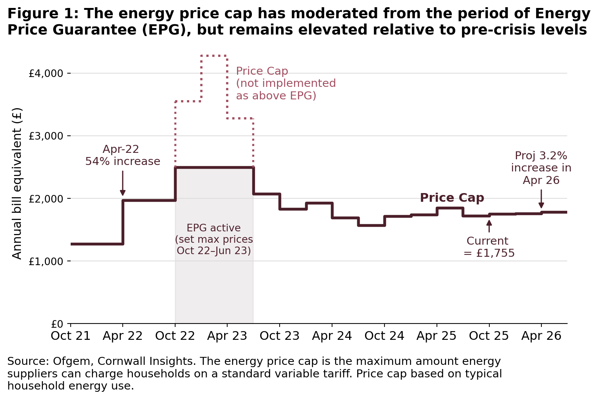{fig-alt="Energy Price Cap (Oct 21 - Apr 26)"}

[^3]: Cornwall insights forecasts that the price cap for energy bills is expected to rise by 3.2% in 2Q26, to account for increases in network costs for electricity [@cornwall_insight_2025].

This persistence places growing pressure on households. Average levels of energy debt and the number of households in arrears have risen sharply since 2021 ([Figure 2]{.underline}), suggesting that many have been unable to absorb higher costs through behavioural adjustments or savings alone [@ofgem_debt_2025].

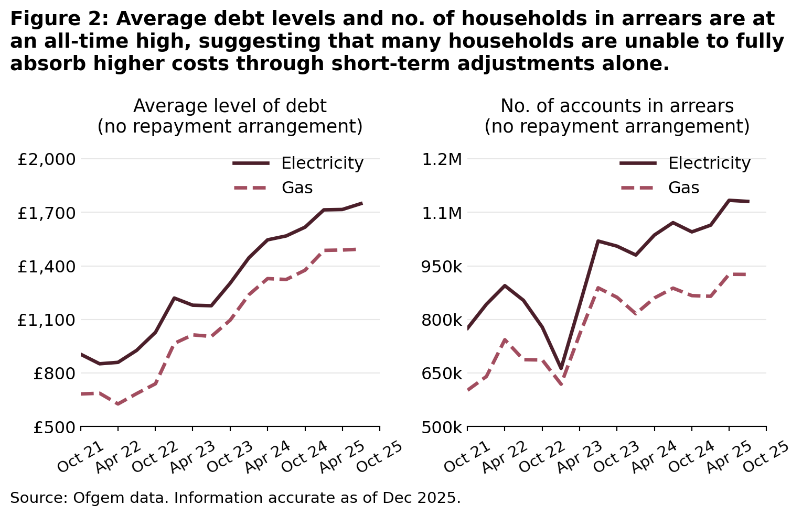{fig-alt="Average debt levels and households in arrears have risen sharply"}

While the impact is most acute for lower-income households, higher energy costs are also squeezing the broad-middle. At least 15% of middle-income households now report struggling to heat their homes adequately [@cook_2025]. It is therefore unsurprising that energy costs remain at the top of public concerns. A March 2025 IPSOS UK survey[^4] found that close to nine in ten respondents (88%) were worried about the price households pay for energy — a figure unchanged since the height of the crisis ([Figure 3]{.underline}).

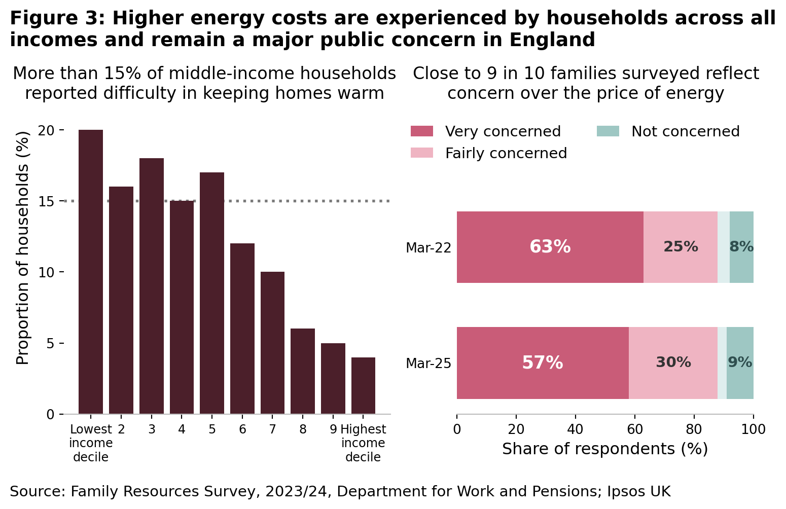{fig-alt="Energy costs remain a major public concern in England"}

[^4]: <https://www.ipsos.com/en-uk/almost-nine-ten-britons-are-concerned-about-energy-prices>

## Exposure is uneven across England 

Although household energy prices are nationally regulated, the costs households face are far from uniform. Average bills depend not only on prices, but on how much energy households consume and how efficiently their homes convert energy into power.

As a result, some households face persistently high energy costs because they live in larger, older or less efficient homes, rely on more expensive heating systems, or have limited scope to reduce consumption. These differences reflect structural characteristics of housing rather than short-term behavioural choices alone.

[Figure 4]{.underline} illustrates this uneven exposure by mapping average household energy costs across England. Higher costs are concentrated across much of the North and Midlands, and parts of the South Coast, while lower average costs are more common in parts of the Southwest and East. There is also substantial variation within regions and cities.

**If tariff rates are broadly similar, why does its impact differ so sharply across households, and what does that imply for equitable energy policy?**

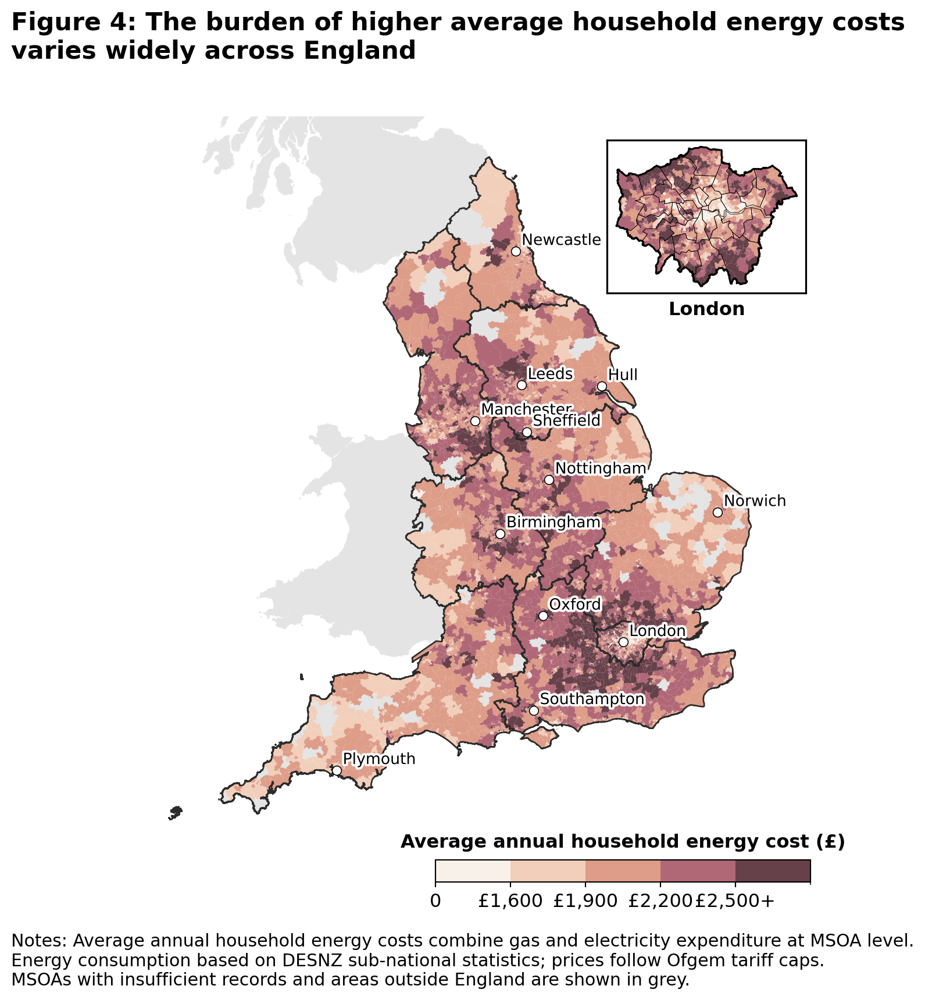{fig-alt="Burden of energy costs across England"}

## What drives differences in household energy costs? 

To explore these drivers, we estimate a multivariate model that relates average household energy costs to building age and energy efficiency, dwelling characteristics, household composition and heating infrastructure, while controlling for regional differences. We aim to identify structural factors that are most strongly associated with high energy costs.

Results are summarised in [Table 1]{.underline}. Three findings stand out.

1.  **Housing energy inefficiency is a central driver of high costs**. Areas with a higher share of energy-inefficient homes (EPC bands D-G), face significantly higher annual energy costs, even after accounting for income and other housing characteristics. Poor insulation and inefficient heating systems amplify the associated increase of high prices, meaning that households in these areas face higher costs even where incomes are comparable to better-insulated areas elsewhere.
2.  **Housing form and household composition matter**. Older and larger dwellings, detached housing and areas with more large households all face higher energy costs, reflecting greater baseline energy needs. These factors help explain why some higher-income areas still experience high absolute cost: higher incomes often coincide with larger, more energy-intensive homes.
3.  **Income shapes households’ capacity to absorb energy costs rather than costs alone**. Higher incomes are associated with higher energy consumption and higher costs, but they also provide greater financial resilience. In contrast, areas characterised by lower incomes have far less scope to accommodate rising costs, particularly where poor housing efficiency or heating systems push cost upwards.

| Structural factor (MSOA-level) | Modelled change in annual energy cost (per HH) |
|--------------------------------------------|----------------------------|
| +10pp share of households with 4+ people | ≈ +£170 |
| +10% increase in median floor area of homes | ≈ +£65-75 |
| +10pp share of EPC D–G homes | ≈ +£50–65 |
| +10pp share of detached homes | ≈+£50-60 |
| +10% increase in household income | ≈+£50-55 |
| +10pp share of pre-1945 housing | ≈+£15-20 |

: Summary of Key Regression Findings

*Note: Effects are indicative averages and reflect associations rather than causal impact*.

These findings explain why financial pressure may extend beyond the lowest-income groups. A substantial share of middle-income households report struggling with energy bills not solely because they consume unusually large amounts of energy, but because structural features expose them to persistently high costs. In equity terms, households with similar incomes can face different energy pressures depending on where and how they live.

## Why place still matters

Even after accounting for income, housing characteristics and heating systems, some spatial variation in energy costs remains. This variation persists after controlling for regional differences, indicating finer localised differences such as housing stock composition, settlement patterns that shape how households experience energy prices.

Using a geographically weighted regression, [Figure 5]{.underline} shows how the influence of income and energy efficiency vary across England. In some areas, higher incomes are closely associated with higher energy costs, reflecting consumption linked to larger or more energy-intensive homes. In others, income plays a much weaker role. In contrast, the cost penalty associated with poor housing efficiency is uneven, with inefficient homes driving higher cost in some places but less so in others.

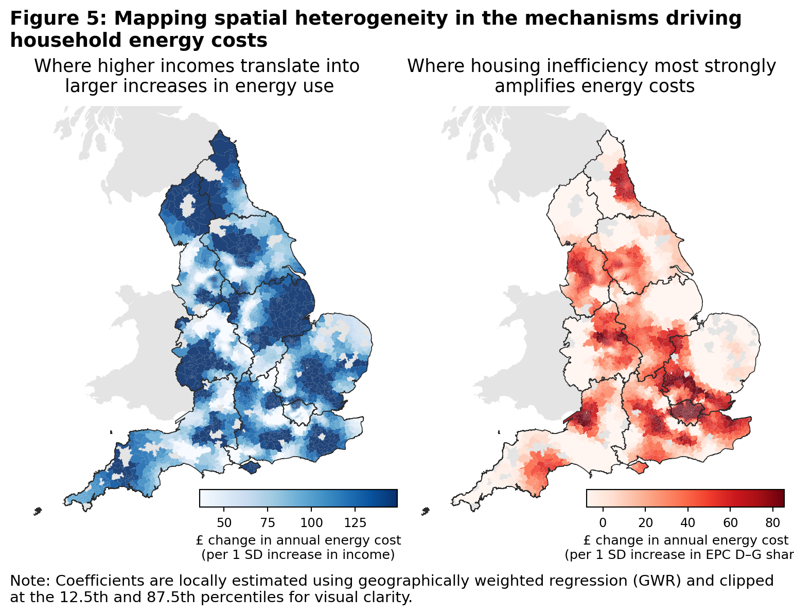{fig-alt="Spatial heterogeneity in mechanisms driving household energy costs"}

## Towards equitable policy: From relief to resilience 

These findings point to several policy considerations:

-   **The limits of blunt instruments:** Universal subsidies are politically expedient and provide immediate relief, but they respond to price rather than to the structural factors that shape consumption. These measures treat symptoms, often subsidizing consumption for those who need it less, while failing to provide deep support for those in the most inefficient homes. 

-   **Efficiency as Long-Term Protection:** Sustained investment in housing energy efficiency, such as insulation and heating upgrades, remains the most effective long-term defense against structurally high prices. This is especially critical in areas where poor housing stock imposes "efficiency penalties" on residents regardless of their income.

-   **Emphasis on Place-Based Targeting:** The spatial heterogeneity identified in this study suggests that national income thresholds alone are insufficient. To ensure support reaches those most exposed, policy must become "place-sensitive," accounting for local housing conditions and structural vulnerabilities that income data alone might overlook.

As energy prices settle at a higher level, the challenge for policymakers is to go beyond smoothing volatility, to designing interventions that shape a more equitable and efficient an energy system.

---

## Technical Appendix

## 1. Study Objectives

This study examines the structural drivers of domestic energy costs (electricity and gas) at the Middle Layer Super Output Area (MSOA) level in England. First, it identifies how housing characteristics, household composition, and heating systems are associated with variation in average annual household energy costs. Second, it assesses whether these relationships exhibit spatial dependence, indicating that some areas are systematically exposed to higher energy costs even after observable characteristics are controlled for.

The analysis is descriptive and explanatory rather than causal. By focusing on small-area averages, it highlights how nationally regulated energy prices translate into uneven local cost pressures through differences in housing stock, energy efficiency and household structure. The emphasis is on identifying structural sources of exposure and inequity, rather than estimating behavioural responses or causal treatment effects.

## 2. Data & Assumptions

### 2.1 Spatial unit analysis and data sources

MSOAs offer a balance between spatial resolution and data stability, avoiding the volatility associated with smaller geographies while preserving meaningful spatial variation. The table below summarizes variables retained in the preferred specification.

| Variable | Source | Methodology & assumptions |
|---------------------|-------------------|--------------------------------|
| Annual electricity consumption (kWh) | @desnz_msoa_consumption_2025 | MSOA mean domestic electricity consumption per meter |
| Annual gas consumption (kWh) | @desnz_msoa_consumption_2025 | MSOA mean domestic gas consumption per meter |
| Electricity & gas prices | @ofgem_price_cap_2024 | National average price cap values (incl. VAT), Jan–Mar 2024 |
| Annual energy cost (dependent variable) | Author | Electricity + gas consumption × unit prices + standing charges |
| Share of pre-1945 housing | @voa_2021 | Proxy for legacy housing inefficiency |
| Share of EPC D–G dwellings | EPC Register, @epc_2025 | Proxy for poor energy efficiency (2019–2025) |
| Median floor area (log) | EPC Register, @epc_2025 | Logged to address skewness |
| Median household income (log) | @ons_income_msoa_2024 | Logged median household income at MSOA-level |
| Share of detached dwellings | @ons_accomodation_2022 | Captures structural heat loss |
| Share of households with 4+ occupants | @ons_hh_size_2022 | Captures household size |
| Heating type shares | @ons_census_heating_2022 | Electric-only, solid/liquid fuels, renewable networks |
| Urban–rural indicator | @ons_ruralurban_2021 | Binary classification |
| Region | @ons_regions_2022 | Region fixed effects |

We assume that energy prices are nationally regulated and spatially uniform, reflecting Ofgem price caps. Spatial variation in observed energy costs therefore arises from differences in consumption, housing efficiency and heating systems rather than local price-setting.

### 2.2 Exploratory analysis of data variables

Exploratory analysis ([Figure A1]{.underline}) highlights substantial right-skewness in electricity costs and total energy costs, driven by a subset of MSOAs with high electricity reliance and larger dwellings. As household income is also right-skewed, log-transformation is applied. Heating system variables are unevenly distributed across space but are retained, as they represent structurally distinct energy systems with implications for electricity demand and exposure to high prices.

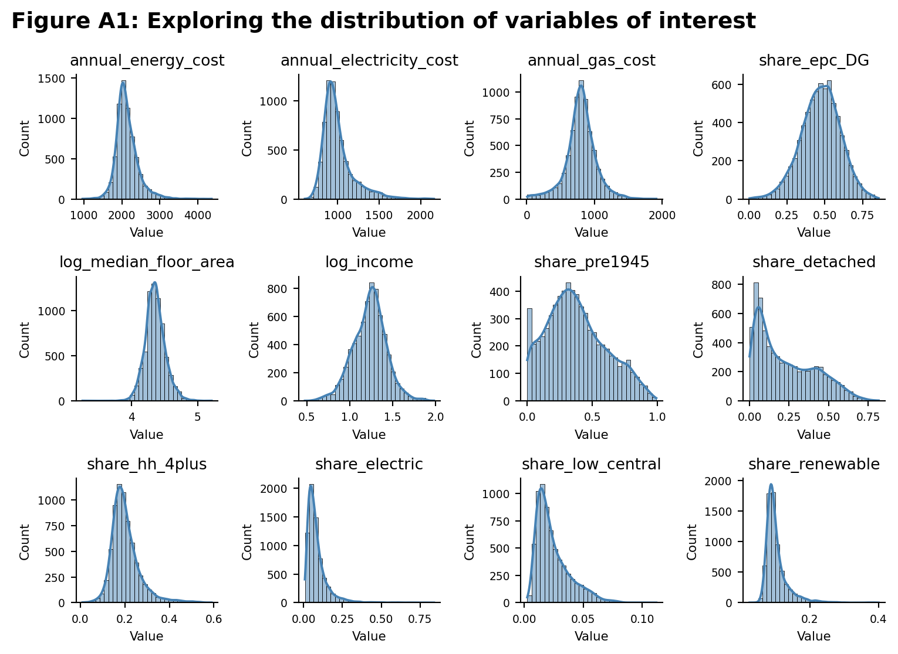{fig-alt="Distribution of variables of interest"}

Exploratory plots of the dependent variable against key predictors ([Figure A2]{.underline}) inform variable selection and specification.

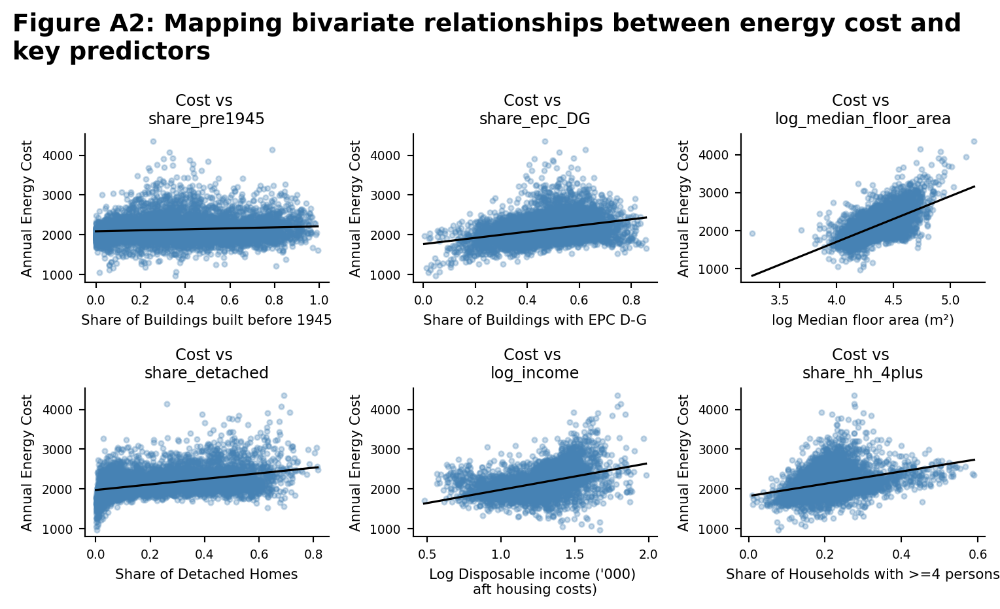{fig-alt="Bivariate relationship between energy cost and key predictors"}

## 3. Methodology and Model Specification

### 3.1 Construction of energy costs

Annual household energy costs are constructed by combining MSOA-level average electricity and gas consumption with national unit prices and standing charges. Electricity and gas costs are calculated separately and summed to obtain total average annual energy cost per household.

### 3.2 Regression framework

Ordinary Least Squares (OLS) regression is used as the primary modelling framework, due to its transparency and interpretability. Coefficients are interpreted as marginal associations with average annual household energy costs. All models are estimated with heteroscedasticity-robust (HC1) standard errors.

The preferred specification is:

$$
\begin{aligned}
\text{EnergyCost}_i
= {} & \alpha
+ \beta_1 \,\text{Pre1945}_i
+ \beta_2 \,\text{EPC}_{D\text{--}G,i}
+ \beta_3 \log(\text{FloorArea}_i) \\
& + \beta_4 \log(\text{Income}_i)
+ \beta_5 \,\text{Detached}_i
+ \beta_6 \,\text{HH}_{4+,i} \\
& + \beta_7 \,\text{FuelMix}_i
+ \beta_8 \,\text{Urban}_i
+ \gamma_r
+ \varepsilon_i
\end{aligned}
$$

where *i* indexes MSOAs and γᵣ denotes region fixed effects.

Variables capture four structural dimensions:

1.  **Housing age and efficiency** (share pre-1945, share EPC D–G)

2.  **Housing scale and form** (log floor area, share detached)

3.  **Household composition and income** (log income, share 4+ households)

4.  **Heating infrastructure** (fuel mix indicators)

Multicollinearity is assessed using variance inflation factors and remains within accepted thresholds.

## 4. Regression Findings

Across all specifications, **structural housing characteristics and household composition** emerge as the primary drivers of variation in annual household energy costs.

-   A higher share of **energy-inefficient dwellings (EPC D–G)** and **pre-1945 housing** is consistently associated with higher energy costs, even after controlling for income and dwelling size. These effects remain stable across all model specifications, indicating that housing efficiency and age exert an independent influence on energy expenditure.

-   **Dwelling size and housing type** are also strongly associated with energy costs. Larger median floor areas and a higher share of detached housing are linked to higher expenditure, reflecting greater baseline energy demand.

-   **Household composition** also plays an important role. MSOAs with a higher share of households containing four or more persons exhibit substantially higher energy costs across all models, with this variable showing the largest coefficients throughout.

-   The inclusion of **fuel mix variables** materially improves explanatory power, with the adjusted $R^2$ increasing from $0.572$ to $0.713$. Electric-only heating is associated with significantly higher energy costs, while solid and liquid fuels and renewables are associated with lower average expenditure.

-   Adding **region fixed effects** further improves model fit (final adjusted $R^2$ = $0.745$), likely capturing residual climatic variation and regional housing patterns, without materially altering the main coefficient estimates.

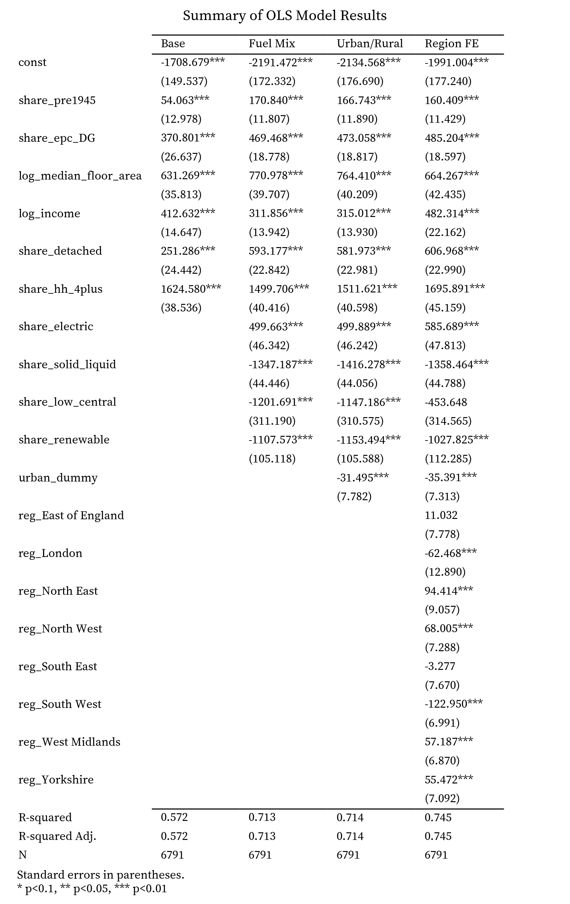{fig-alt="regression_table"}

Residual diagnostics ([Figure A3]{.underline}) indicate satisfactory linearity and variance homogeneity, with mild right-skewness. Checks reveal a small number of high-cost MSOAs that tend to have larger dwellings and higher reliance on electricity.

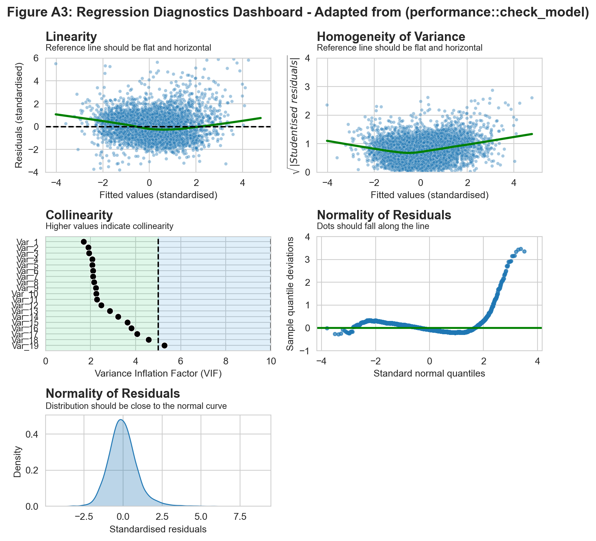{fig-alt="Regression diagnostics dashboard"}

| Variable | VIF | Plot Label |
| :--- | :--- | :--- |
| `reg_North East` | 1.686154 | Var_1 |
| `share_epc_DG` | 1.902158 | Var_2 |
| `share_hh_4plus` | 1.927551 | Var_3 |
| `reg_Yorkshire` | 2.067431 | Var_4 |
| `reg_South West` | 2.071966 | Var_5 |
| `reg_West Midlands` | 2.102305 | Var_6 |
| `share_pre1945` | 2.106134 | Var_7 |
| `urban_dummy` | 2.147526 | Var_8 |
| `share_electric` | 2.224277 | Var_9 |
| `reg_East of England` | 2.245763 | Var_10 |
| `share_renewable` | 2.277739 | Var_11 |
| `reg_North West` | 2.469844 | Var_12 |
| `reg_South East` | 2.849354 | Var_13 |
| `share_solid_liquid` | 3.225414 | Var_14 |
| `share_detached` | 3.631050 | Var_15 |
| `log_median_floor_area` | 3.815178 | Var_16 |
| `log_income` | 4.066691 | Var_17 |
| `share_low_central` | 4.577141 | Var_18 |
| `reg_London` | 5.265254 | Var_19 |

## 5. Investigating spatial dependence 

Global Moran’s I tests on OLS residuals show positive spatial autocorrelation ($I = 0.43$), indicating that neighbouring MSOAs share some unobserved characteristics influencing energy costs.

### 5.1 Spatial Error Model (SEM) 

To account for this, a Spatial Error Model (SEM) was estimated using maximum likelihood. The SEM identifies strong spatial correlation in the error term $(λ ≈ 0.73)$, consistent with possible omitted spatially structured factors such as housing typologies, retrofit histories or local infrastructure.

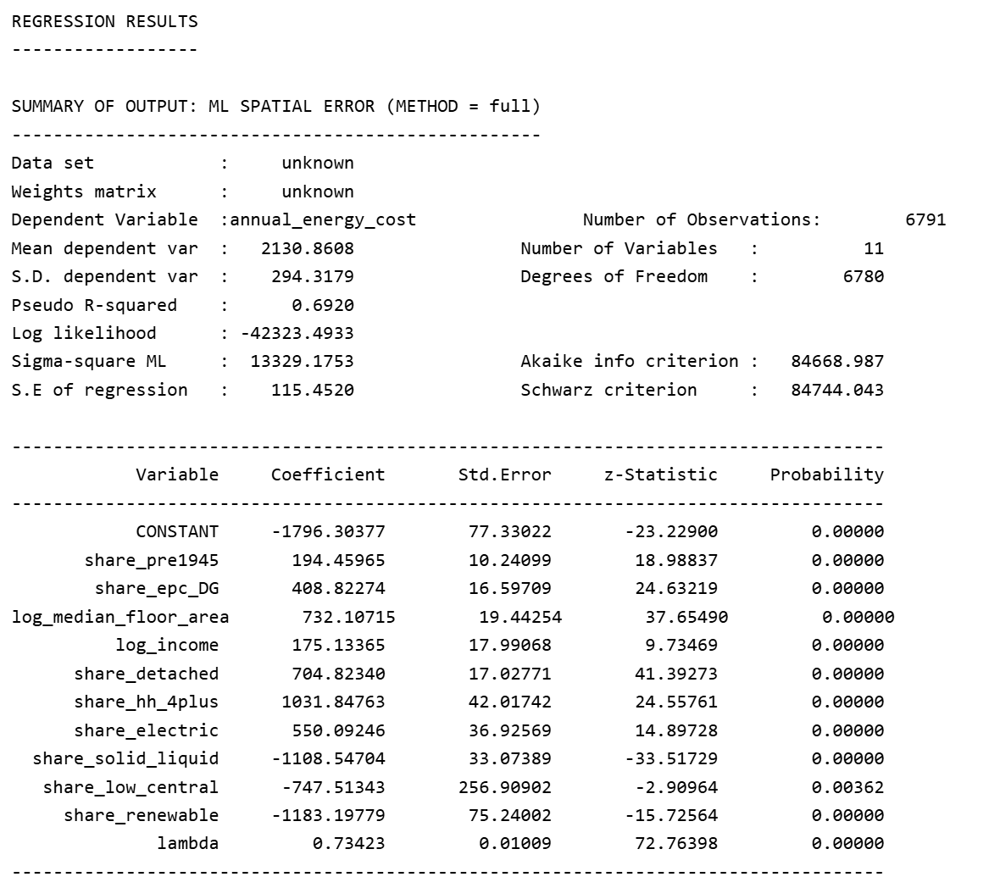{fig-alt="Spatial Error Model"}

Notwithstanding, the findings are robust: **coefficient signs and magnitudes remain consistent with OLS estimates**. This suggests that while spatially clustered unobserved factors influence energy cost exposure, core structural relationships are correctly specified.

### 5.2 Geographically Weighted Regression (GWR)

To further **explore spatial heterogeneity in coefficients**, Geographically Weighted Regression (GWR) was employed to examine how the impact of income and housing efficiency vary spatially. An adaptive bandwidth was selected via AICc.

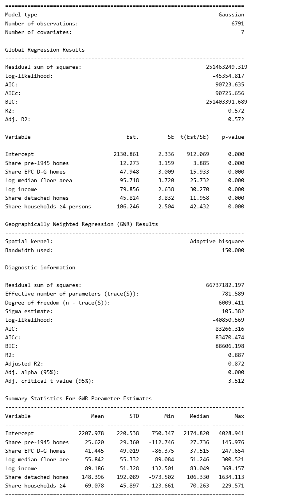{fig-alt="GWR"}

Additional findings include:

-   **Income-Driven Areas**: Higher energy costs align with income, suggesting consumption-led demand.

-   **Efficiency-Driven Areas**: High EPC D–G coefficients indicate that poor housing quality drives costs regardless of household wealth.

While GWR reached an $R^2$ of 0.88, the elevated fit likely reflects GWR’s inherent local overfitting and results serve an exploratory purpose rather than a formal refutation of the global model’s performance.

## 6. Reflections and Limitations

### 6.1 Limitations

Several constraints qualify the findings above.

**Area-level inference.** The analysis operates on MSOA averages, so it cannot capture heterogeneity *within* areas. Two neighbourhoods with identical average costs may contain very different distributions of household circumstances, and relationships observed between area averages may not necessarily hold for individual households. Findings should therefore be read as identifying where structural exposure is concentrated, not which households experience it.

**Behavioural adaptation is invisible.** Observed consumption reflects energy *used*, not energy *needed*. Households that ration heating in response to cost appear in the data as low consumers, which cannot be disentangled from those in efficient homes with genuinely low demand. Under-heating is a documented response to affordability pressure, which means measured costs may understate exposure precisely where it is more acute.

**EPC coverage and currency.** EPC records are generated at points of sale, letting or new build rather than continuously, so coverage is uneven and skewed toward recently transacted stock. Records are sparser in rural areas and in stable owner-occupied neighbourhoods, and an EPC issued several years ago may not reflect subsequent retrofit work. The `share_epc_DG` variable is best read as a proxy for housing quality rather than a current census of it.

**Metering and off-grid households.** DESNZ consumption data is reported per meter rather than per household, which introduces error where properties share meters or hold multiple. More importantly, gas figures cover only gas-metered properties, so households off the gas grid which are concentrated in rural areas and reliant on oil, LPG or solid fuel, are absent from the gas component of the cost calculation, likely understating their true energy expenditure.

**Temporal alignment.** Consumption and price data are drawn from different reference periods, and prices are held at a single national cap value. The resulting cost estimates are therefore best understood as a consistent comparative index across areas rather than an accurate reconstruction of any particular year's bills.

### 6.2 Reflections

The analysis reinforces that variation in energy costs across England is structural rather than incidental. Housing age, efficiency, dwelling size and household composition consistently explain more of the variation than income alone, and these relationships held across every specification tested, including after accounting for spatial dependence. 

It also underlines that a nationally uniform price does not produce a uniform burden. Because the same tariff interacts with very different housing stock, the geography of energy cost tracks the geography of building quality more closely than it tracks the geography of income. This has practical implications for delivery, since housing stock is precisely the domain where local authorities and councils hold both knowledge and levers, through retrofit programmes, targeted efficiency schemes and local housing interventions that national income thresholds cannot replicate.

Methodologically, the exercise was a useful demonstration of the usefulness of spatial regression techniques. The Spatial Error Model served primarily as a robustness check with the persistence of coefficient signs and magnitudes under an explicitly spatial error structure giving more confidence in the core specification than OLS diagnostics alone could. GWR was an interesting exploratory instrument for asking *where* relationships differ rather than *whether* they exist. Its high local fit is a reason for caution rather than confidence, but the spatial patterning affirmed that income mattered more in some regions, efficiency in others, complementing the findings of the global model.

## 7. Annex: Additional Visualisation 

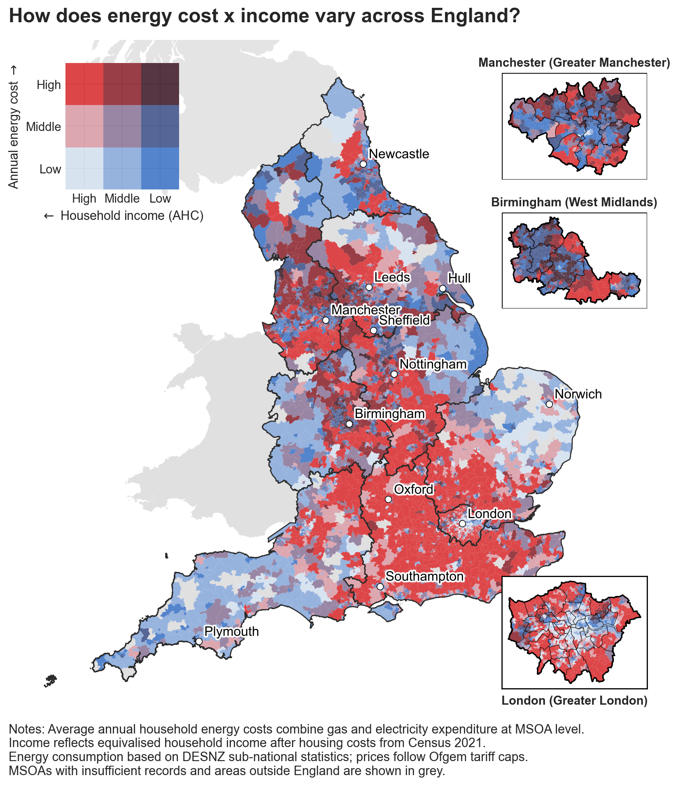{fig-alt="Annex: How does energy cost and income vary across England"}

*This article was submitted as part of my coursework for the CASA0007 Quantitative Methods (QM) assignment. Source code and data can be found [here](https://github.com/benjamintee/CASA_QM_Assessment).* 

## References

