## 1. Background

Economic inequality remains a persistent structural challenge. @piketty_2014 document rising wealth inequality across advanced economies, driven by returns to capital exceeding economic growth. Geography plays a foundational role in shaping these dynamics. @krugman_1991 shows how spatial clustering of economic activity creates self-reinforcing regional inequality while @chetty_2014 demonstrate that a child's place of birth remains one of the strongest predictors of economic mobility in the United States. These findings suggest that spatial resource distribution can imposes structural constraints that individual ability alone cannot overcome. Understanding why inequality emerges and what sustains it is relevant for policymakers designing redistributive interventions.

Intergenerational transfers compound these effects. @nekoei_how_2023 find that inheritances may initially reduce inequality but reverse over time as wealthier heirs accumulate more while poorer heirs deplete transfers.

Because such dynamics are difficult to isolate using traditional econometric methods, agent-based models provide a useful alternative for examining path dependence and emergent inequality [@farmer_2009]. SugarScape [@epstein_1996] which was originally designed to simulate how complex social phenomena emerge from simple interactions among heterogeneous individuals competing for limited resources, offers a useful framework for investigating how geography and inheritance jointly influence wealth stratification.

## 2. Aim 

This study investigates how spatial resource distribution and intergenerational wealth transfers shape inequality. Two NetLogo SugarScape models were adapted to examine these mechanisms separately. **SugarScape 2 evaluates how resource concentration (1 peak versus 4 peaks) affects survivability and inequality within a single generation. SugarScape 3 introduces wealth and location inheritance to understand how intergenerational transfers interact with geography to amplify or dampen inequality over time**. Inequality is measured in both using the Gini coefficient[^1].

[^1]: The Gini coefficient measures the inequality of a frequency distribution such as income or wealth levels [@hasell_2023]. A Gini coefficient of 0 reflects perfect equality, where all income or wealth values are the same. In contrast, a Gini coefficient of 1 reflects maximal inequality among values, where a single individual has all the income or wealth while all others have none.

## 3. Methods

### 3.1 Model Modifications

SugarScape 2 (Constant Growback) and 3 (Wealth Distribution) from the NetLogo Models Library [@Wilensky_Sugarscape2; @Wilensky_Sugarscape3] were modified to share a common 50×50 landscape and agent trait ranges.

Resource maps were generated programmatically with 1–4 symmetric *hills*, using concentric sugar rings (1-4) scaled to maintain approximately constant total sugar (\~3,700). Agents were assigned random *vision* (1-3), *metabolism* (1–3) and *initial endowment* (10–25).

SugarScape 3 further introduces:

1.  **Wealth Inheritance:** An *inheritance-rate* (0–1) transfers a fraction of a dying agent’s sugar to offspring. Only agents above median wealth pass on sugar, simulating capital preservation opportunities available only to wealthier populations.

2.  **Location Inheritance:** An *inherit-location?* toggle allows offspring to spawn near the parent (within 3 patches) rather than at a random location.

Additional reporters were added to track *inequality (Gini), wealth, survival,* and *mortality*. 

### 3.2 Key Assumptions

SugarScape 2 models within-generation competition without replacement. Agents compete for resources and die permanently when sugar reaches zero. With no replacement, the population declines.

SugarScape 3 introduces finite lifespans with *max-age* (60-80) and one-to-one replacement, maintaining a constant population. With *inheritance-rate* set to zero, each generation begins without accumulated advantage. Increasing *inheritance-rate* introduces compounding effects.

All experiments used 400 initial agents and 10 repetitions per parameter combination and 1,000 ticks. Both models assumed constant growback (1 sugar per tick up to patch maximum), without trade, and movement toward the highest visible sugar patch.

### 3.3 Experimental Design

[*Experiment 1 (S2)*]{.underline}*:* *num-hills* was varied from 1 to 4 ([Figure 1]{.underline}) to examine spatial concentration effects.

[*Experiment 2 (S3)*]{.underline}*:* *inheritance-rate* was varied at intervals of 0.25 between 0.00 and 1.00, with *inherit-location?* toggled on and off, holding geography constant with *num-hills = 2*. *inheritance-rate* was subsequently varied at intervals of 0.05 to explore tipping points. 

## 4. Results

### 4.1 Experiment 1: Resource Concentration and Inequality (S2)

[Figure 2]{.underline} shows how Gini changes over time for each hill configuration. All configurations begin with Gini around **0.122** and rise sharply in the first 100 ticks as agents compete for resources and weaker agents die off. The trajectories then plateau. The 1-hill configuration reaches the highest final Gini **(0.448)**, while the 4-hill configuration reaches the lowest **(0.354)**, with 2-hill and 3-hill configurations falling in between.

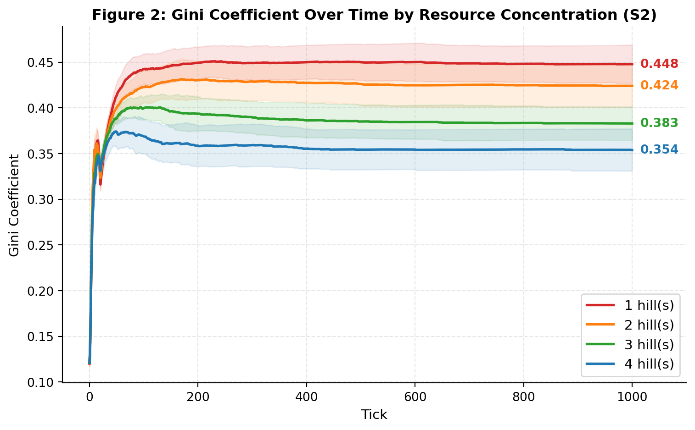{fig-alt="Gini Over Time by Resource Concentration"}

With total sugar held constant, survival rates were similar across configurations, suggesting that resource geography affects wealth distribution rather than carrying capacity. Mean wealth increased from **959** in the 1-hill setup to **1,117** in the 4-hill setup.

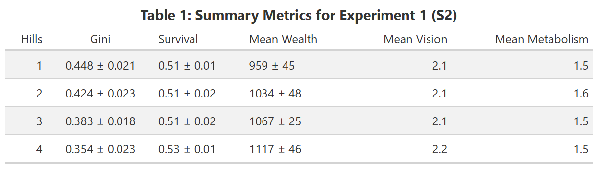{fig-alt="Table1"}

### 4.2 Experiment 2: Inheritance and Inequality (S3)

The introduction of wealth and location inheritance reveals a complex, non-linear relationship between intergenerational transfers and wealth stratification.

### 4.2.1 Wealth Inheritance only

[Figure 3]{.underline} plots Gini trajectories under varying *inheritance-rate* (0.00-1.00) without location inheritance. At moderate *inheritance-rate* (0.25-0.50), the Gini is lower than the no-inheritance baseline, falling from **0.458** to **0.431** at *inheritance-rate = 0.50*. However, at higher *inheritance-rate* (0.75-1.00), the Gini rises sharply above the baseline reaching up to **0.551** at full *inheritance-rate* (1.00).

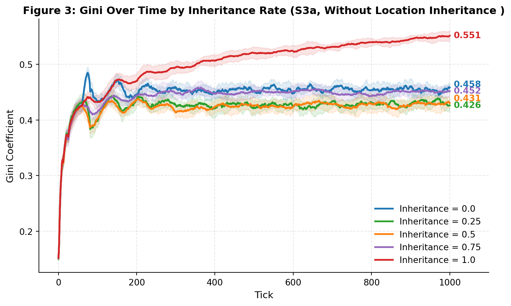{fig-alt="Gini Over Time by Inheritance Rate"}

This U-shaped pattern reflects two competing dynamics. Moderate inheritance acts as insurance where offspring of above-median agents receive a buffer that reduces the impact of unfavourable random traits, compressing wealth distribution. At higher *inheritance-rates*, larger transfers create persistent wealth differences where wealth compounds across generations faster than it dissipates. *Mean wealth* rises significantly from **35** at baseline to **183** at full *inheritance-rate* ([Table 2]{.underline}). *Death rate* decreases monotonically from **9.6** to **7.5**, with fewer starvation deaths as *inheritance-rate* increases.

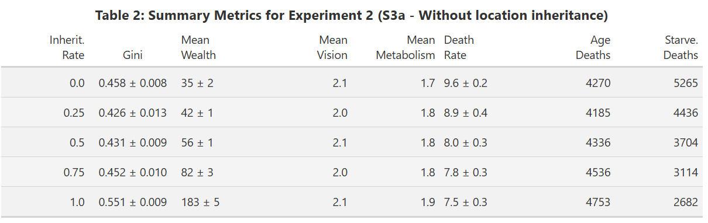{fig-alt="Table2"}

### 4.2.2 Wealth and Location Inheritance

([Figure 4]{.underline}) shows that the U-shaped Gini pattern persists when location inheritance is added.

However, enabling location inheritance reduces inequality compared to wealth inheritance alone. At *inheritance-rate* = 0, simply allowing offspring to start near their parent's location reduces the Gini from **0.458** to **0.396**. Offspring of successful agents are born close to productive resource hills, reducing search cost and early starvation risk. Over successive generations, agents gradually optimise their positions, compressing the gini distribution from below.

[Figure 5]{.underline} traces this mechanism. Location inheritance primarily operates through improved mortality. Starvation deaths fall from **5,265** to **4,028** at *inheritance-rate* = 0 when location inheritance is added, allowing more agents to survive to old age rather than dying in resource-scarce areas. 

At *inheritance-rate* = 1, the effect on mean wealth becomes dramatic, rising from **183** without location inheritance to **342** with it, indicating that inherited proximity to resource hills enables compounding that wealth transfers alone cannot achieve ([Figure 6]{.underline}). However, this advantage narrows the gap at high inheritance rates as both conditions converge to similarly elevated Gini values (**0.551** vs. **0.541** at full inheritance), as capital accumulation increasingly dominates spatial effects ([Figure 7]{.underline}). 

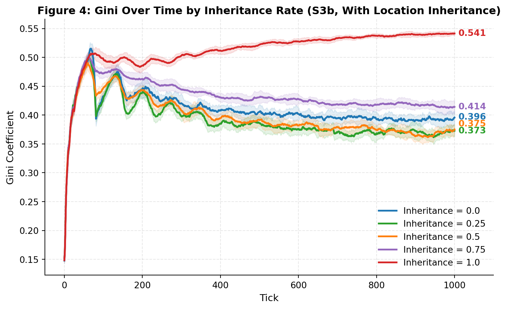{fig-alt="Gini Over Time by Inheritance Rate"}

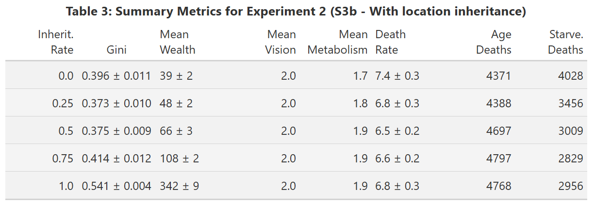{fig-alt="Table3"}

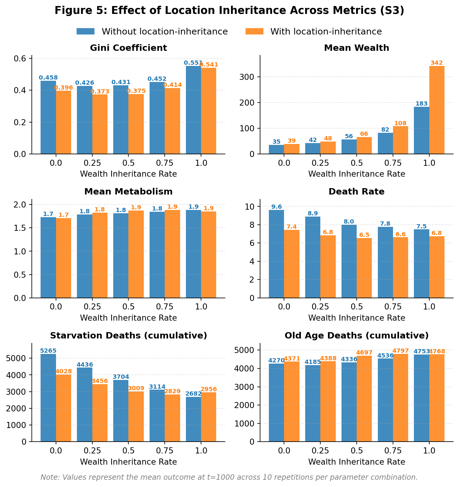{fig-alt="Effect of Location Inheritance Across Metrics"}

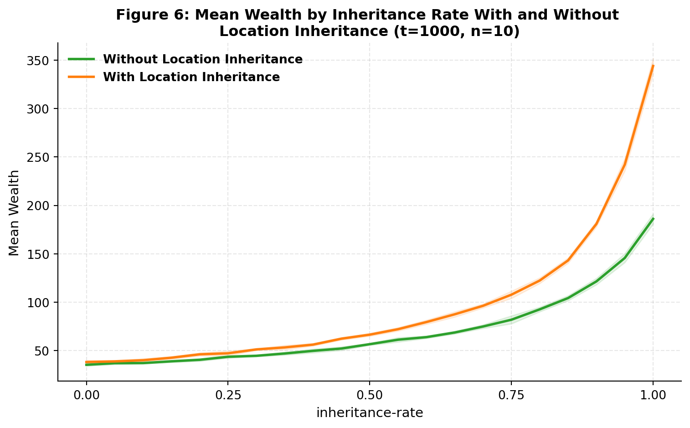{fig-alt="Mean Wealth by Inheritance Rate"}

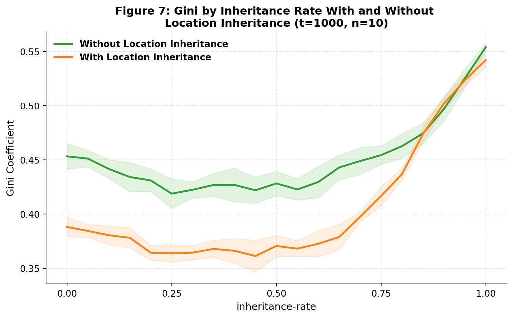{fig-alt="Gini by Inheritance Rate"}

### 4.2.3 Comparison between experiments

The experiments reveal that geography establishes a structural baseline range of inequality generated through spatial competition, within which intergenerational mechanisms operate.

At low to moderate *inheritance rates* (0.25–0.50), inequality falls below the spatial-only baseline as modest transfers buffer stochastic disadvantage and compress dispersion, even while *mean wealth* rises. Once *inheritance rates* exceeds a threshold (≥ 0.75), accumulation dominates and wealth compounds across generations faster than it dissipates. Inequality then surpasses the spatial baseline, reaching **0.551** at full inheritance without location persistence and **0.541** with location persistence. 

While the Gini coefficient provides a consistent basis for comparison, it captures different structural forms of inequality. In SugarScape 2, inequality reflects competitive selection within a single generation, driven by spatial concentration and trait variation. In SugarScape 3a, the Gini captures the net effect of capital persistence and competitive selection. In SugarScape 3b, inequality becomes spatially embedded, reflecting intergenerational transmission of both capital and locational advantage. Thus, similar Gini values across experiments may reflect fundamentally different generative mechanisms.

## 5. Discussion

### 5.1 Wealth inheritance dynamics (Insurance vs Accumulation)

The results highlight the interesting dual-nature of wealth inheritance. At low levels, it functions as a social safety net, reducing the number of "stochastic deaths" caused by poor trait draws (e.g., high metabolism or poor location endowment). However, as *inheritance-rate* approaches 1.0, the system transitions into a dynastic regime. Wealth becomes less a signal of agent fitness (vision or metabolism) but of ancestral luck.

### 5.2 Location inheritance dynamics

Location inheritance amplifies these dynamics as a powerful wealth multiplier. At low levels, location inheritance reduces *death rate* with some improvement in *mean wealth*. But at higher levels, when agents inherit both sugar and proximity to resource hills, significant compounding sees *mean wealth* at full inheritance nearly double relative to the wealth-only condition. This mirrors structural advantages in real-world systems where the wealthy compound gains through passive proximity to opportunities over generations, while agents without such positional inheritance must perform with near-flawless efficiency to achieve comparable outcomes.

### 5.3 Limitations and Sensitivities

Several limitations constrain the generalisability of findings.

-   **Constant Population:** The model utilizes a one-to-one replacement system upon agent death (*hatch 1*). In real-world systems, birth rates often correlate inversely with wealth, which could create steeper inequality trajectories.

-   **Static Resource Hills:** In a more dynamic environment, resource depletion or shifting climates could force migration, potentially disrupting the "location inheritance" advantage.

-   **Trait Sensitivity:** The Gini trajectories are highly sensitive to the metabolism and vision ratio. If metabolism were increased relative to sugar grow-back rates, the "insurance effect" of moderate inheritance might disappear, as even a small inheritance would be insufficient to prevent risk of starvation.

-   **Limitations of the Gini coefficient:** While the Gini coefficient provides a consistent basis for comparing inequality across spatial and inheritance regimes, it captures only the dispersion of wealth at a given moment, and does not distinguish between inequality arising from competitive selection and that arising from dynastic persistence. In high-inheritance scenarios, measured inequality may resemble or even fall below spatial-only baselines, yet wealth becomes increasingly decoupled from agent traits and more dependent on inherited position. The Gini therefore detects distributional change but not the underlying mechanism generating it. Future extensions could incorporate mobility (e.g. Rank-Rank slope [@van_der_erve_2024; @Joanna_Venator_2015]) or lineage-based measures to better capture structural persistence.

## 6. Conclusion

This study shows that spatial resource distribution establishes a structural baseline for inequality, but intergenerational transmission shapes how that inequality evolves. In the absence of inheritance, inequality reflects spatial competition and trait-based selection. Introducing wealth transfers produces a non-linear effect where moderate inheritance reduces inequality by buffering agents against stochastic disadvantage, while high inheritance generates compounding effects that exceeds the inequality produced by geography alone. Location inheritance reinforces these dynamics by lowering survival risk near productive resource clusters and accelerating wealth accumulation. 

These findings suggest that inequality is shaped not only by unequal access to space, but by mechanisms that allow advantage to persist and accumulate across generations. Policies aimed at reducing inequality must therefore address both spatial disparities in opportunity and the channels through which unfair wealth and locational advantages are transmitted.

## Additional Diagrams  

Screenshot of Netlogo Interface under Experiment 1 (S2)

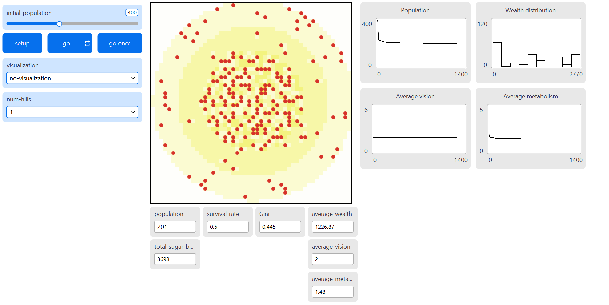{fig-alt="Netlogo Interface under Experiment 1 (S2)"}

Screenshot of Netlogo Interface under Experiment 2 (S3)

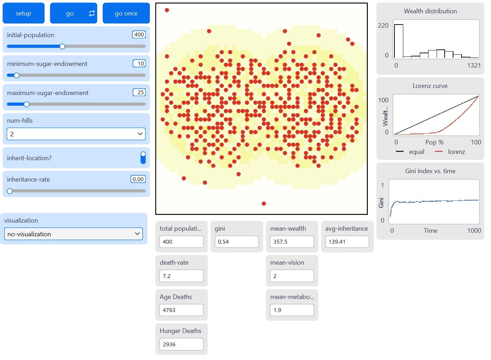{fig-alt="Netlogo Interface under Experiment 2 (S3)"}

*This article was submitted as part of my coursework for the CASA0011 Agent-Based Modelling for Spatial Systems module.*  
*Source code can be found [here]{.underline} (<https://github.com/benjamintee/CASA_ABM_Assessment>)*  
*Netlogo models can be found [here]{.underline} (<https://github.com/benjamintee/CASA_ABM_Assessment/nlogo>)*

## References