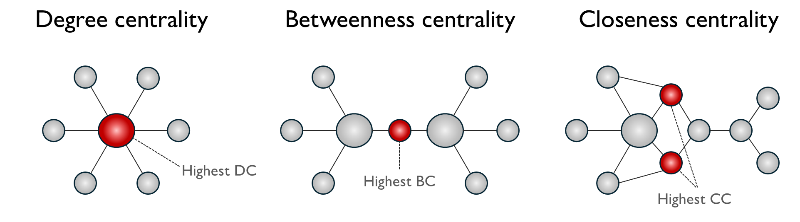

## 1. Objective

This analysis applies concepts in network science to evaluate the resilience of the London Underground. We examine the differences when we look at the network topologically and when weighted by observed passenger flows. The study then rounds off by simulating station closures, to identify which stations have the most significant impact on the network. 

## 2. Background

Network science began with a puzzle about a city. In 1736, Leonhard Euler was asked whether one could cross all seven bridges of the Königsberg exactly once. His answer, that this depended not on the bridges' lengths or the city's layout, but on how the landmasses connected, established a founding insight of graph theory:  structure alone determines what a system permits [@hopkins_early_2009].

The method is surprisingly simple. Represent a system as **nodes** joined by **edges**, and much of its behaviour becomes calculable. For a transit network, the translation is natural: stations are nodes, track between them edges. This gives a **topological network**, a map of connectivity, indifferent to distance or demand, which isolates what the system's shape alone implies about where it is fragile.

But structure is only half the story. A station may sit at a critical junction and carry almost nobody while another may lie on an unremarkable stretch of line and move tens of thousands each morning. Attaching passenger volumes to edges produces a **weighted network**, shifting the question from how a system is built to how it is actually used. 

Resilience can be further understood through the concept of **centrality** which asks the question "which nodes matter most". Depending on the objective, a station might be important because many lines meet there, because a disproportionate share of journeys must route through it, or because it sits close to everywhere else. 

## 3. Network Centrality Measures

Centrality measures [@newman_measures_2010] can be computed for the underground network as follows: 

1.  **Degree Centrality** counts the number of direct connections a node has, reflecting its immediate prominence in the network. For a node v in graph G with N nodes, it can be represented as:

    $$
    C_D(v) = \frac{deg(v)}{N-1}
    $$

    where $deg(v)$ is the number of edges that are incident to $v$ and the denominator normalises by the maximum possible degree. **Degree centrality** identifies underground stations with the most number of direct line connections such as interchanges (e.g. King's Cross St. Pancras station with six lines). High degree nodes are critical because they are the primary points of passenger transfer between lines. When a high-degree station fails, passengers lose multiple routing options.

2.  **Betweenness Centrality** measures how frequently a node lies on the shortest path between other node pairs. It can be represented as

    $$
    x_i = \sum_{s \neq i \neq t} \frac{\sigma_{st}(i)}{\sigma_{st}}
    $$

    where $\sigma_{st}$ is the total number of shortest paths between nodes $s$ and $t$, $\sigma_{st}(i)$ is the number of those paths passing through node $i$, and the condition $s \neq i \neq t$ indicates that $i$ is an intermediate node rather than an endpoint. **Betweenness centrality** identifies stations that act as 'bridges' or 'brokers' in the underground network where a disproportionate share of journeys must pass through to find the shortest route. They sit at structurally pivotal positions in the network geography and bridge between two otherwise weakly connected clusters. High betweenness centrality nodes are critical because their removal would force many passengers onto less efficient alternative routes or eliminate viable routes altogether.

3.  **Closeness Centrality** measures how close a node is to all other nodes in the network, based on the sum of shortest path distances. It can be represented as:

    $$
    C_i = \frac {1}{l_i} = \frac {n}{\sum_j d_{ij}} 
    $$

    where $d_{ij}$ us the length of a geodesic path from $i$ to $j$ and $l_i$ is the mean geodesic distance from $i$ to $j$, averaged over all vertices in the network. **Closeness centrality** identifies underground stations from which the entire network is most efficiently reachable which minimise expected travel time or transfers to any destination. From a resilience perspective, high closeness stations are crucial because their failure degrades network-wide accessibility most severely. When a high-closeness station closes, average journey lengths across the entire network increase substantially.

{fig-alt="A quick visual of centrality measures"}

## 4.1 Topological Network 

The topological measure of the network reflects the infrastructural view of the network with stations as nodes and connecting lines as unweighted edges. While this allows us to identify structurally important stations based on network position, it may abstracts away information (e.g. distance, passenger flows) that could matter more.

```{python}
#| echo: false
#| warning: false
#| output: false
# Load relevant libraries 
import osmnx as ox
import os
import networkx as nx
import pandas as pd
import numpy as np
import geopandas as gpd
import matplotlib.pyplot as plt
from shapely.geometry import Point
```
```{python}
#| echo: false
#| warning: false
#| output: false
# Load the tube network from graph provided 
DATA_DIR = r"C:\Users\benja\Documents\CASA\CASA\Urban Simulation\CASA_UrbSIM_Assessment\data"
PATH = os.path.join(DATA_DIR, 'london_updated.graph')

G_1 = nx.read_graphml(PATH)
print(f"This graph has {G_1.number_of_nodes()} nodes, and {G_1.number_of_edges()} edges." )

# Check to see what data is available in the graph 
df = nx.to_pandas_edgelist(G_1)
df[0:10]
```

```{python}
#| echo: false
#| warning: false
#| output: false
# 1. DEGREE CENTRALITY 
deg = nx.degree_centrality(G_1)
nx.set_node_attributes(G_1, deg, 'degree')

df_deg_top10 = (
    pd.DataFrame.from_dict(deg, orient='index', columns=['Degree Centrality'])
    .rename_axis('Station')
    .reset_index()
    .sort_values('Degree Centrality', ascending=False)
    .head(10)
    .reset_index(drop=True)
)
df_deg_top10.index += 1
df_deg_top10['Degree Centrality'] = df_deg_top10['Degree Centrality'].round(4)

# 2. BETWEENNESS CENTRALITY (TOPOLOGICAL)
bet = nx.betweenness_centrality(G_1, normalized=False)
nx.set_node_attributes(G_1, bet, 'betweenness')

df_bet_top10 = (
    pd.DataFrame.from_dict(bet, orient='index', columns=['Betweenness Centrality'])
    .rename_axis('Station')
    .reset_index()
    .sort_values('Betweenness Centrality', ascending=False)
    .head(10)
    .reset_index(drop=True)
)
df_bet_top10.index += 1
df_bet_top10['Betweenness Centrality'] = df_bet_top10['Betweenness Centrality'].round(1)

# 3. CLOSENESS CENTRALITY (TOPOLOGICAL)
clo = nx.closeness_centrality(G_1)
nx.set_node_attributes(G_1, clo, 'closeness')

df_clo_top10 = (
    pd.DataFrame.from_dict(clo, orient='index', columns=['Closeness Centrality'])
    .rename_axis('Station')
    .reset_index()
    .sort_values('Closeness Centrality', ascending=False)
    .head(10)
    .reset_index(drop=True)
)
df_clo_top10.index += 1
df_clo_top10['Closeness Centrality'] = df_clo_top10['Closeness Centrality'].round(4)
```

```{python}
#| echo: false
#| warning: false
#| label: tbl-centrality
#| tbl-cap: "Top 10 stations by degree, betweenness, and closeness centrality (topological network)"
#| output: asis

from IPython.display import Markdown

tops = {
    "Degree Centrality":      df_deg_top10,
    "Betweenness Centrality": df_bet_top10,
    "Closeness Centrality":   df_clo_top10,
}

# Markdown requires unique column names, so each rank header gets a
# different number of spaces — they all render as "Rank"
cols = {}
for i, (name, d) in enumerate(tops.items()):
    cols[" " * (i + 1)] = list(range(1, 11))
    cols[name] = d.iloc[:, 0].values

combined = pd.DataFrame(cols)
Markdown(combined.to_markdown(index=False))
```

## 4.2 Scenario Analysis - Topological node removal 

To investigate the resilience of the topological network, we sequentially remove the highest ranked node (by each centrality measure) and evaluate the impact on the (a) number of connected components, (b) largest connected component, (c) diameter of the largest connected component. 

| Metric | What it measures | What a change signals |
|---|---|---|
| **Number of connected components** | How many separate sub-networks the system has fractured into. A value of 1 means every station remains reachable from every other. | An increase means the network has broken apart: some stations can no longer be reached from others by tube at all. |
| **Size of the largest connected component (LCC)** | The number of stations in the biggest remaining intact sub-network. | A sharp fall means the removal has severed a substantial portion of the network, not merely trimmed its edges. |
| **Diameter of the largest connected component** | The longest shortest path within that sub-network — the number of stops between its two most distant stations. | An increase means journeys have become less direct: the network still holds together, but passengers must travel further to cross it. |

: Structural metrics used to assess network degradation under sequential node removal {#tbl-resilience-metrics}

```{python}
#| echo: false
#| warning: false
#| output: false
# SEQUENTIAL NODE REMOVAL — LCC ANALYSIS
# For each centrality measure, we sequentially remove the
# highest-ranked node, recomputing the measure after each
# removal. We track (1) Node removed, (2) Number of connected components
# (3) Size of Largest Connected Component (LCC), (4) Diameter of LCC

import networkx as nx
import pandas as pd
def sequential_node_removal(G, centrality_fn, measure_name, n_removals=10):

    G_copy = G.copy()
    results = []

    # Iteration 0 — baseline before any removal
    components  = list(nx.connected_components(G_copy))
    lcc         = max(components, key=len)
    lcc_subgraph = G_copy.subgraph(lcc)
    results.append({
        'Iteration':           0,
        'Node Removed':        '—',
        'LCC Size':            len(lcc),
        'No. of Components':   nx.number_connected_components(G_copy),
        'Diameter of LCC':     nx.diameter(lcc_subgraph),
    })

    for i in range(1, n_removals + 1):
        # Recompute centrality on current graph
        centrality = centrality_fn(G_copy)

        # Identify highest-ranked node
        top_node = max(centrality, key=centrality.get)

        # Remove it
        G_copy.remove_node(top_node)

        # Recompute LCC
        components   = list(nx.connected_components(G_copy))
        lcc          = max(components, key=len)
        lcc_subgraph = G_copy.subgraph(lcc)

        # Diameter 
        try:
            diameter = nx.diameter(lcc_subgraph)
        except nx.NetworkXError:
            diameter = float('inf')

        results.append({
            'Iteration':         i,
            'Node Removed':      top_node,
            'LCC Size':          len(lcc),
            'No. of Components': nx.number_connected_components(G_copy),
            'Diameter of LCC':   diameter,
        })

        print(f"  [{i:02d}] Removed: {top_node:<30} "
              f"| Components: {nx.number_connected_components(G_copy):>3} "
              f"| LCC: {len(lcc):>3} "
              f"| Diameter: {diameter}")

    return pd.DataFrame(results)

# ── RUN ALL THREE MEASURES ───────────────────────────────────────────────────
measures = {
    "Degree":      nx.degree_centrality,
    "Betweenness": lambda G: nx.betweenness_centrality(G, normalized=False),
    "Closeness":   nx.closeness_centrality,
}

removal_results = {
    name: sequential_node_removal(G_1, fn, name, n_removals=10)
    for name, fn in measures.items()
}

df_removal_deg = removal_results["Degree"]
df_removal_bet = removal_results["Betweenness"]
df_removal_clo = removal_results["Closeness"]
```

```{python}
#| echo: false
#| warning: false
#| output: asis

from IPython.display import Markdown, display

for i, (name, dfr) in enumerate(removal_results.items(), start=1):
    display(Markdown(
        f"{dfr.to_markdown(index=False)}\n\n"
        f": Sequential node removal ranked by {name.lower()} centrality "
        f"{{#tbl-removal-{name.lower()}}}\n\n"
    ))
```

```{python}
#| echo: false
#| warning: false
#| label: fig-node-removal
#| fig-cap: "Network degradation under sequential node removal, by centrality measure. Each removal targets the highest-ranked remaining node, with centrality recomputed after every step."
import matplotlib.pyplot as plt
import matplotlib.ticker as mticker

fig, axes = plt.subplots(1, 3, figsize=(13, 5))

# ── Colours and labels ────────────────────────────────────────────
colours = {
    'Degree':      '#E63946',
    'Betweenness': '#2A9D8F',
    'Closeness':   '#F4A261',
}

measures = {
    'Degree':      df_removal_deg,
    'Betweenness': df_removal_bet,
    'Closeness':   df_removal_clo,
}

# ── Plot 1: LCC Size ──────────────────────────────────────────────
ax1 = axes[0]
for label, df in measures.items():
    ax1.plot(
        df['Iteration'], df['LCC Size'],
        marker='o', markersize=5, linewidth=2,
        color=colours[label], label=label
    )

ax1.set_title('Largest Connected Component Size',
              fontsize=14, fontweight='bold', pad=10)
ax1.set_xlabel('Nodes Removed', fontsize=12)
ax1.set_ylabel('Number of Stations in LCC', fontsize=12)
ax1.set_xticks(range(0, 11))

# ── Plot 2: Number of Components ──────────────────────────────────
ax2 = axes[1]
for label, df in measures.items():
    ax2.plot(
        df['Iteration'], df['No. of Components'],
        marker='o', markersize=5, linewidth=2,
        color=colours[label], label=label
    )

ax2.set_title('Number of Connected Components',
              fontsize=14, fontweight='bold', pad=10)
ax2.set_xlabel('Nodes Removed', fontsize=12)
ax2.set_ylabel('Number of Components', fontsize=12)
ax2.set_xticks(range(0, 11))
ax2.yaxis.set_major_locator(mticker.MaxNLocator(integer=True))

# ── Plot 3: Diameter of LCC ───────────────────────────────────────
ax3 = axes[2]
for label, df in measures.items():
    ax3.plot(df['Iteration'], df['Diameter of LCC'],
             marker='o', markersize=5, linewidth=2,
             color=colours[label], label=label)
ax3.set_title('Diameter of Largest Component',
              fontsize=14, fontweight='bold', pad=10)
ax3.set_xlabel('Nodes Removed', fontsize=12)
ax3.set_ylabel('Longest Shortest Path (stops)', fontsize=12)
ax3.set_xticks(range(0, 11))
ax3.yaxis.set_major_locator(mticker.MaxNLocator(integer=True))

# Single shared legend centred at top
handles, labels = ax1.get_legend_handles_labels()
fig.legend(
    handles, labels,
    loc='upper center',
    ncol=3,
    fontsize=15,
    frameon=False,
    bbox_to_anchor=(0.5, 1.1)
)

plt.tight_layout()
plt.show()
```

The results reveal differences in how each measure identifies vulnerable stations and the severity of degradation following removal.

**Degree centrality** targets the most connected interchange stations. Its effect on the largest component is gradual (337 stations retained after 10 removals), but it fragments the network more than either alternative, producing 8 separate components and stretching the surviving diameter furthest, from 36 to 59 stops. Removing well-connected hubs shears off peripheral branches without severing the core.

**Betweenness centrality** identifies broker stations lying on the greatest number of shortest paths. Early removals produce similar degradation to degree, but removing West Hampstead at iteration 6 cuts the LCC from 375 to 227 stations in a single step. The accompanying fall in diameter, from 55 to 38, is not an improvement: the network has shed its longest branches into separate fragments rather than becoming more compact. Broker stations are distinctive because they act as sole connectors between otherwise separate segments, so their failure causes disproportionate connectivity loss.

**Closeness centrality** targets stations that anchor overall network efficiency. Its first five removals leave the network entirely intact, with the diameter expanding steadily from 36 to 50 stops. Removing Canada Water at iteration 6 then collapses the LCC from 396 to 226 stations, showing that a network can absorb sustained degradation before failing abruptly.

These distinctions carry direct policy implications. *High-betweenness stations* (King's Cross, West Hampstead, Euston) represent structural failure risks requiring contingency planning and route redundancy. *High-closeness stations* (Green Park, Waterloo, Bank and Monument) anchor system-wide efficiency, and their disruption warrants demand-management strategies even where connectivity remains intact. *Betweenness centrality* is the most operationally useful single measure for identifying catastrophic failure points, but it should be monitored alongside *closeness centrality*, which captures the slower degradation in journey times that fragmentation metrics miss entirely.

## 5.1 Weighted Network (Flows)

```{python}
#| echo: false
#| warning: false
#| output: false
# 2.1 WEIGHTED CENTRALITY MEASURES (FLOWS)
#   Repeat the three centrality measures from 1.1, this time
#   weighting edges by passenger flows
#   Degree:      weighted degree = sum of flows on all edges
#   Betweenness: uses inverse flows as distance (higher flow = lower cost) 
#   Closeness:   uses inverse flows as distance (higher flow
#                = lower cost = closer)

# Add inverse flow as edge attribute for closeness
for u, v, data in G_1.edges(data=True):
    G_1[u][v]['inv_flows'] = 1.0 / max(data['flows'], 1)

# ── 1. WEIGHTED DEGREE (strength) ────────────────────────────────
deg_w = dict(G_1.degree(weight='flows'))
nx.set_node_attributes(G_1, deg_w, 'degree_w')

df_deg_w_top10 = (
    pd.DataFrame.from_dict(deg_w, orient='index', columns=['Weighted Degree'])
    .rename_axis('Station')
    .reset_index()
    .sort_values('Weighted Degree', ascending=False)
    .head(10)
    .reset_index(drop=True)
)
df_deg_w_top10.index += 1
df_deg_w_top10['Weighted Degree'] = df_deg_w_top10['Weighted Degree'].round(0)

# ── 2. WEIGHTED BETWEENNESS ───────────────────────────────────────
bet_w = nx.betweenness_centrality(G_1, weight='inv_flows', normalized=False)
nx.set_node_attributes(G_1, bet_w, 'betweenness_w')

df_bet_w_top10 = (
    pd.DataFrame.from_dict(bet_w, orient='index', columns=['Weighted Betweenness'])
    .rename_axis('Station')
    .reset_index()
    .sort_values('Weighted Betweenness', ascending=False)
    .head(10)
    .reset_index(drop=True)
)
df_bet_w_top10.index += 1
df_bet_w_top10['Weighted Betweenness'] = df_bet_w_top10['Weighted Betweenness'].round(0)

# ── 3. WEIGHTED CLOSENESS (inverse flows as distance) ─────────────
clo_w = nx.closeness_centrality(G_1, distance='inv_flows')
nx.set_node_attributes(G_1, clo_w, 'closeness_w')

df_clo_w_top10 = (
    pd.DataFrame.from_dict(clo_w, orient='index', columns=['Weighted Closeness'])
    .rename_axis('Station')
    .reset_index()
    .sort_values('Weighted Closeness', ascending=False)
    .head(10)
    .reset_index(drop=True)
)
df_clo_w_top10.index += 1
df_clo_w_top10['Weighted Closeness'] = df_clo_w_top10['Weighted Closeness'].round(2)
```

```{python}
#| echo: false
#| warning: false
#| label: tbl-centrality-weighted
#| tbl-cap: "Top 10 stations by weighted degree, betweenness, and closeness centrality (flow-weighted network). Betweenness and closeness use inverse flows as edge weights, so heavily used corridors are treated as shorter paths."
#| output: asis

from IPython.display import Markdown

tops_w = {
    "Weighted Degree":      df_deg_w_top10,
    "Weighted Betweenness": df_bet_w_top10,
    "Weighted Closeness":   df_clo_w_top10,
}

# Markdown requires unique column names, so each rank header gets a
# different number of spaces — they all render as empty
cols = {}
for i, (name, d) in enumerate(tops_w.items()):
    cols[" " * (i + 1)] = list(range(1, 11))
    cols[name] = d.iloc[:, 0].values

combined_w = pd.DataFrame(cols)
Markdown(combined_w.to_markdown(index=False))
```

Attaching flows changes the picture substantially. Under **weighted degree centrality**, [**Bank & Monument**]{.underline} (646,117) has the largest connection strength in passenger terms — a station's importance now reflects how many people pass through it rather than how many lines meet there.

The shift is sharper for **weighted betweenness**, where [**Green Park**]{.underline} (45,000) emerges as the most critical broker, followed by *Bank and Monument* (36,249) and *Waterloo* (31,444). *Stratford*, which topped the topological betweenness ranking, falls to sixth. *Green Park's* rise makes operational sense: it sits at the intersection of the Jubilee, Victoria and Piccadilly lines, bridging three of the highest-flow corridors in central London. The weighted ranking concentrates almost entirely on Zone 1, reflecting that the most operationally significant brokers are those bridging the highest-demand corridors, not those that happen to lie on topological shortest paths.

Under **weighted closeness**, [**Green Park**]{.underline} ranks first (95.98), with *Westminster*, *Waterloo* and *Bank and Monument* close behind. The scores are, however, tightly clustered. The top ten span less than 0.1%, which suggests both a well-connected Zone 1 core and that inverse-flow weighting compresses the distance scale enough to limit the measure's discriminating power.

## 5.2 Scenario Analysis - Closure of Origin Station

*Station-pair with largest Origin-Destination (OD) Flow* 

```{python}
#| echo: false
#| warning: false
#| output: false
# PART 2.2: LARGEST OD FLOW AND IMPACT OF ORIGIN CLOSURE
PATH_OD = os.path.join(DATA_DIR, 'OD_matrix.csv')

OD = pd.read_csv(PATH_OD, index_col=0)
OD_melt = OD.iloc[:-1, :-1].reset_index().melt(
    id_vars='station_origin', value_vars=OD.columns[:-1]
)
OD_melt.columns = ['station_origin', 'station_destination', 'flows']
OD_melt = OD_melt[OD_melt.station_origin != OD_melt.station_destination]

# ── Find largest direct OD flow ───────────────────────────────────
df_od = (
    OD_melt[['station_origin', 'station_destination', 'flows']]
    .sort_values('flows', ascending=False)
    .reset_index(drop=True)
)
df_od.index += 1

# Largest OD pair
top_origin      = df_od.iloc[0]['station_origin']
top_destination = df_od.iloc[0]['station_destination']
top_flow        = df_od.iloc[0]['flows']

print(f"\nLargest OD flow:")
print(f"  Origin:      {top_origin}")
print(f"  Destination: {top_destination}")
print(f"  Flow:        {top_flow:,} passengers")

# ── Impact of origin closure ──────────────────────────────────────
# Total passengers affected = all flows originating from that station
origin_outflows = OD_melt[
    OD_melt['station_origin'] == top_origin
]['flows'].sum()

origin_inflows = OD_melt[
    OD_melt['station_destination'] == top_origin
]['flows'].sum()

total_affected = origin_outflows + origin_inflows

print(f"\nImpact of closing {top_origin}:")
print(f"  Total outbound flow from origin:  {origin_outflows:,} passengers")
print(f"  Total inbound flow to origin:     {origin_inflows:,} passengers")
print(f"  Total passengers affected:        {total_affected:,} passengers")
```

The largest single origin–destination flow runs from **`{python} top_origin`** to
**`{python} top_destination`**, carrying `{python} f"{top_flow:,.0f}"` passengers during
the AM peak.  This reflects the intense commuter demand between the South Bank and the City of London during morning rush hour.

Closing `{python} top_origin` would affect  
- **`{python} f"{total_affected:,.0f}"`** passengers in total  
- **`{python} f"{origin_outflows:,.0f}"`** departing and  
- **`{python} f"{origin_inflows:,.0f}"`** arriving.  

These figures reflect AM Peak demand only (NUMBAT timeband 3), and are most applicable to peak commuter conditions. Waterloo's role as a major South Bank terminus means its AM Peak outflows are particularly high relative to other periods. It should be noted that the OD flows represent direct station-to-station demand from the NUMBAT dataset [@tfl_2025], distinct from the edge-level flow weights used in the weighted centrality analysis in Section 2.1, which were derived by assigning all OD demand onto shortest paths through the network.

```{python}
#| echo: false
#| warning: false
#| label: tbl-top-od
#| tbl-cap: "Top 10 origin–destination pairs by passenger flow (AM peak, Monday–Thursday)"
#| output: asis

from IPython.display import Markdown

top_od = df_od.head(10).copy()
top_od.columns = ["Origin", "Destination", "Passengers"]
top_od["Passengers"] = top_od["Passengers"].map("{:,.0f}".format)
top_od.insert(0, "Rank", range(1, 11))

Markdown(top_od.to_markdown(index=False))
```

*Routing options for closure of origin station*

If the origin station were closed, which station should passengers go to instead, and how long would it take them to walk there? These are questions network analysis can answer directly.

Candidate stations were first identified within 1,500 m Euclidean distance of the affected station.

```{python}
#| echo: false
#| warning: false
#| output: false
# PART 2.3: ALTERNATIVE STATION AND WALKING TIME
#   1. Pre-filter: stations within 1800m Euclidean distance of Waterloo
#   2. Compute walking time on road network to each candidate
#   3. Compute shortest tube path + travel time to Bank & Monument
#   4. Rank by total travel time (walk + tube)

from shapely.geometry import Point
import geopandas as gpd

WALK_SPEED_MS   = 1.3          # m/s — TfL (FOI-0318-2526)
TUBE_SPEED_MS   = 10.0         # m/s — approximate average tube speed (~36 km/h)
EUCLIDEAN_M     = 1500       
ORIGIN          = 'Waterloo'
DESTINATION     = 'Bank and Monument'

def get_station_coords(G, station_name):
    """Extract lat/lon from node coords attribute stored as BNG string."""
    coords_str = G.nodes[station_name].get('coords', None)
    if coords_str:
        coords = eval(coords_str)
        point = gpd.GeoSeries(
            [Point(coords[0], coords[1])], crs=27700
        ).to_crs(4326).iloc[0]
        return point.y, point.x
    return None

def get_station_coords_bng(G, station_name):
    """Return BNG (easting, northing) coordinates directly."""
    coords_str = G.nodes[station_name].get('coords', None)
    if coords_str:
        return eval(coords_str)
    return None

# ── Step 1: Euclidean pre-filter ──────────────────────────────────
origin_bng = get_station_coords_bng(G_1, ORIGIN)

candidate_stations = []
for station in G_1.nodes():
    if station in [ORIGIN, DESTINATION]:
        continue
    s_bng = get_station_coords_bng(G_1, station)
    if s_bng is None:
        continue
    euclidean_dist = (
        (s_bng[0] - origin_bng[0])**2 +
        (s_bng[1] - origin_bng[1])**2
    ) ** 0.5
    if euclidean_dist <= EUCLIDEAN_M:
        candidate_stations.append({
            'station':        station,
            'euclidean_dist': round(euclidean_dist),
        })

df_candidates = (
    pd.DataFrame(candidate_stations)
    .sort_values('euclidean_dist')
    .reset_index(drop=True)
)
print(f"\nStations within {EUCLIDEAN_M}m Euclidean distance of {ORIGIN}:")
print(df_candidates.to_string())

# ── Step 2: Walking time on road network to each candidate ────────
origin_coords = get_station_coords(G_1, ORIGIN)
G_road = ox.graph_from_point(origin_coords, dist=EUCLIDEAN_M,
                              network_type='walk')
origin_node = ox.nearest_nodes(G_road, origin_coords[1], origin_coords[0])

walk_results = []
for _, row in df_candidates.iterrows():
    station = row['station']
    try:
        s_coords  = get_station_coords(G_1, station)
        s_node    = ox.nearest_nodes(G_road, s_coords[1], s_coords[0])
        road_dist = nx.shortest_path_length(
            G_road, origin_node, s_node, weight='length'
        )
        walk_time_mins = (road_dist / WALK_SPEED_MS) / 60
        walk_results.append({
            'Alternative Station':  station,
            'Euclidean Dist (m)':   row['euclidean_dist'],
            'Walking Distance (m)': round(road_dist),
            'Walking Time (mins)':  round(walk_time_mins, 1),
        })
    except (nx.NetworkXNoPath, nx.NodeNotFound):
        continue

# Table 1 — Walking times ranked by road network distance
df_walk = (
    pd.DataFrame(walk_results)
    .sort_values('Walking Distance (m)')
    .reset_index(drop=True)
)
df_walk.index += 1

# ── Step 3: Tube travel time from each candidate to destination ───
tube_results = []
for _, row in df_walk.iterrows():
    station = row['Alternative Station']
    try:
        tube_dist = nx.shortest_path_length(
            G_1, station, DESTINATION, weight='length'
        )
        tube_time_mins = (tube_dist / TUBE_SPEED_MS) / 60
        path = nx.shortest_path(G_1, station, DESTINATION, weight='length')
        tube_results.append({
            'Alternative Station':      station,
            'Walking Distance (m)':     row['Walking Distance (m)'],
            'Walking Time (mins)':      row['Walking Time (mins)'],
            'Tube Distance (m)':        round(tube_dist),
            'Tube Time (mins)':         round(tube_time_mins, 1),
            'Total Time (mins)':        round(row['Walking Time (mins)'] + tube_time_mins, 1),
            'Tube Path':                ' → '.join(path),
        })
    except nx.NetworkXNoPath:
        continue

# Table 2 — Total travel time ranked
df_final = (
    pd.DataFrame(tube_results)
    .sort_values('Total Time (mins)')
    .reset_index(drop=True)
)
df_final.index += 1
```
```{python}
#| echo: false
#| warning: false
#| label: tbl-candidates
#| tbl-cap: "Stations within 1,500 m straight-line distance of Waterloo"
#| output: asis

from IPython.display import Markdown

cand = df_candidates.copy()
cand.columns = ["Station", "Straight-line distance (m)"]
cand["Straight-line distance (m)"] = cand["Straight-line distance (m)"].map("{:,.0f}".format)
cand.insert(0, "Rank", range(1, len(cand) + 1))

Markdown(cand.to_markdown(index=False))
```

For each candidate, walking distance from Waterloo was computed as the shortest path on the OSMnx pedestrian road network. Assuming a walking speed of 1.3 m/s [@TfL_planning_2020], this yields a walking time. Tube travel time was then added, based on the shortest path through the Underground network to the destination station. Two rankings follow: the closest station on foot, and the fastest overall journey.

```{python}
#| echo: false
#| warning: false
#| label: tbl-best-total
#| tbl-cap: "Alternative stations ranked by shortest total travel time"
#| output: asis

from IPython.display import Markdown

# ── Best alternatives by each criterion ──────────────────────────
best_walk  = df_final.sort_values('Walking Time (mins)').iloc[0]
best_total = df_final.sort_values('Total Time (mins)').iloc[0]

# Station names, derived rather than hardcoded, so the map and tables agree
BEST_WALK  = best_walk['Alternative Station']
BEST_TOTAL = best_total['Alternative Station']

COLS = ["Alternative Station", "Walking Time (mins)", "Walking Distance (m)",
        "Tube Time (mins)", "Total Time (mins)"]
HEADERS = ["Alternative station", "Walking time (min)", "Walking dist (m)",
           "Tube time (min)", "Total travel time (min)"]
# Rank, station, then four numeric columns
COLALIGN = ("right", "left", "right", "right", "right", "right")


def render(df, sort_col):
    out = df.sort_values(sort_col)[COLS].copy()
    out.columns = HEADERS
    out["Walking dist (m)"] = out["Walking dist (m)"].map("{:,.0f}".format)
    # Fixed 1dp so 17.0 doesn't render as 17 alongside 17.1
    for c in ["Walking time (min)", "Tube time (min)", "Total travel time (min)"]:
        out[c] = out[c].map("{:.1f}".format)
    out.insert(0, "Rank", range(1, len(out) + 1))
    # disable_numparse stops tabulate re-parsing these strings back to numbers
    # (which would strip the 1dp); colalign then sets alignment explicitly,
    # since text columns would otherwise default to left
    return Markdown(out.to_markdown(index=False,
                                    disable_numparse=True,
                                    colalign=COLALIGN))


render(df_final, "Total Time (mins)")
```

The fastest alternative journey runs through **`{python} best_total['Alternative Station']`** at
`{python} f"{best_total['Total Time (mins)']:.1f}"` minutes.

Walking times across all candidates range from
`{python} f"{df_final['Walking Time (mins)'].min():.1f}"` to
`{python} f"{df_final['Walking Time (mins)'].max():.1f}"` minutes, so the burden of disruption falls unevenly depending on where within the station's catchment a passenger begins.

```{python}
#| echo: false
#| warning: false
#| label: fig-alternatives
#| fig-cap: "Alternative boarding stations following Waterloo closure. Candidates lie within 1,800 m straight-line distance of the closed station, with walking routes computed on the OSMnx pedestrian network and journey times to Bank and Monument. The three fastest options by total travel time are highlighted; the second and third are effectively tied given the model's flat tube-speed assumption."
#| column: page

import math
import matplotlib.pyplot as plt
import matplotlib.lines as mlines
import osmnx as ox

ox.settings.use_cache = True
ox.settings.cache_folder = "./cache"
ox.settings.requests_timeout = 300

# ── Top three alternatives by total travel time ─────────────────────────────
TOP_N = 3
top_alt = df_final.sort_values('Total Time (mins)').head(TOP_N)
TOP_STATIONS = list(top_alt['Alternative Station'])

# Ranked colours: warmest for the best option, lighter as rank falls
RANK_COLOURS = ['#f1563e', '#f2a05d', '#f7d378']
RANK_FILLS = ['#FBE3DA', '#FDEFE0', '#FBF4DF']
NETWORK_GREY = '#c8c8c8'   # base road network
ROUTE_GREY = '#787878'   # non-highlighted walking routes — darker than base
CLOSED_COLOUR = '#d81626'
DEST_COLOUR = '#2c6b95'

# ── Plotting extent ─────────────────────────────────────────────────────────
origin_coords_ll = get_station_coords(G_1, ORIGIN)
dest_coords = get_station_coords(G_1, DESTINATION)

all_lons = [origin_coords_ll[1], dest_coords[1]]
all_lats = [origin_coords_ll[0], dest_coords[0]]
for _, row in df_walk.iterrows():
    c = get_station_coords(G_1, row['Alternative Station'])
    if c:
        all_lons.append(c[1])
        all_lats.append(c[0])

lon_min_pad = min(all_lons) - 0.008
lon_max_pad = max(all_lons) + 0.012
lat_min_pad = min(all_lats) - 0.005
lat_max_pad = max(all_lats) + 0.003

# ── Road network covering the full extent ───────────────────────────────────
try:
    G_road = ox.graph_from_bbox(
        bbox=(lon_min_pad, lat_min_pad, lon_max_pad, lat_max_pad),
        network_type='walk')
except TypeError:
    G_road = ox.graph_from_bbox(
        north=lat_max_pad, south=lat_min_pad,
        east=lon_max_pad, west=lon_min_pad, network_type='walk')

origin_node = ox.nearest_nodes(
    G_road, origin_coords_ll[1], origin_coords_ll[0])
dest_node = ox.nearest_nodes(G_road, dest_coords[1], dest_coords[0])

fig, ax = plt.subplots(figsize=(14, 9))

# ── 1. Base street network ──────────────────────────────────────────────────
ox.plot_graph(G_road, ax=ax, node_size=0, edge_color=NETWORK_GREY,
              edge_linewidth=0.4, show=False, close=False)

# ── 2. Walking routes — collected so labels can treat them as obstacles ─────
route_lines = []

for _, row in df_walk.iterrows():
    station = row['Alternative Station']
    if station in (ORIGIN, DESTINATION):
        continue

    if station in TOP_STATIONS:
        colour = RANK_COLOURS[TOP_STATIONS.index(station)]
        lw, alpha, z = 3.2, 0.95, 6
    else:
        # Darker and thicker than the base network so candidate routes read
        # as routes rather than blending into the street layer
        colour, lw, alpha, z = ROUTE_GREY, 1.8, 0.7, 4

    c = get_station_coords(G_1, station)
    if c is None:
        continue
    try:
        s_node = ox.nearest_nodes(G_road, c[1], c[0])
        path = nx.shortest_path(G_road, origin_node, s_node, weight='length')
        ln, = ax.plot([G_road.nodes[n]['x'] for n in path],
                      [G_road.nodes[n]['y'] for n in path],
                      color=colour, linewidth=lw, alpha=alpha,
                      zorder=z, solid_capstyle='round')
        route_lines.append(ln)
    except (nx.NetworkXNoPath, nx.NodeNotFound):
        continue

# ── 3. Direct walk to destination ───────────────────────────────────────────
try:
    path = nx.shortest_path(G_road, origin_node, dest_node, weight='length')
    ln, = ax.plot([G_road.nodes[n]['x'] for n in path],
                  [G_road.nodes[n]['y'] for n in path],
                  color=DEST_COLOUR, linewidth=1.4, linestyle=(0, (5, 3)),
                  alpha=0.7, zorder=5)
    route_lines.append(ln)
except (nx.NetworkXNoPath, nx.NodeNotFound):
    pass

# ── 4. Station markers and labels ───────────────────────────────────────────
# Fixed per-station offsets: predictable and reproducible across renders,
# unlike a force-directed solver. Alignment is derived from the offset
# direction so the box always sits on the intended side of the marker.
LABEL_DX, LABEL_DY = -10, 10     # points; default is above-left

LABEL_OFFSETS = {
    'Southwark':         (14,  10),
    'Elephant & Castle': (10,  10),
    'Borough':           (10,  10),
    'Blackfriars':       (10,  10),
    'Westminster':       (0, -10),
    "St. James's Park":  (0, -10),
    'Charing Cross':     (-10, -5),
    'Lambeth North':     (0, -15),
    'Leicester Square':  (0,  10),
    'Covent Garden':     (0,  10),
    'Temple':            (0,  10),
    'Embankment':        (10,  12),
}


def align_from_offset(dx, dy):
    """Anchor the box on the opposite side to the offset direction."""
    ha = 'left' if dx > 0 else 'right' if dx < 0 else 'center'
    va = 'bottom' if dy > 0 else 'top' if dy < 0 else 'center'
    return ha, va


for _, row in df_walk.iterrows():
    station = row['Alternative Station']
    if station in (ORIGIN, DESTINATION):
        continue
    c = get_station_coords(G_1, station)
    if c is None:
        continue

    tr = df_final[df_final['Alternative Station'] == station]
    total = tr['Total Time (mins)'].values[0] if len(tr) else '?'

    if station in TOP_STATIONS:
        rank = TOP_STATIONS.index(station)
        colour = RANK_COLOURS[rank]
        fc = RANK_FILLS[rank]
        size, fs, weight, z = 220, 14, 'bold', 9
        label = (f"{rank + 1}. {station}\n"
                 f"{row['Walking Time (mins)']} min walk\n"
                 f"{total} min total")
    else:
        colour, fc = ROUTE_GREY, 'white'
        size, fs, weight, z = 100, 13, 'normal', 7
        label = station

    dx, dy = LABEL_OFFSETS.get(station, (LABEL_DX, LABEL_DY))
    ha, va = align_from_offset(dx, dy)

    ax.scatter(c[1], c[0], s=size, color=colour, edgecolors='black',
               linewidths=1.2 if size > 100 else 0.6, zorder=z - 1)
    ax.annotate(
        label, xy=(c[1], c[0]),
        xytext=(dx, dy), textcoords='offset points',
        ha=ha, va=va,
        fontsize=fs, fontweight=weight, color='#222222',
        bbox=dict(boxstyle='round,pad=0.3', fc=fc, alpha=0.92,
                  edgecolor=colour if size > 100 else '#AAAAAA',
                  linewidth=1.0 if size > 100 else 0.5),
        zorder=z)

# ── 5. Origin and destination ───────────────────────────────────────────────
ax.scatter(origin_coords_ll[1], origin_coords_ll[0], s=480, color=CLOSED_COLOUR,
           marker='X', edgecolors='black', linewidths=1.2, zorder=10)
ax.annotate(f"{ORIGIN}\nCLOSED", xy=(origin_coords_ll[1], origin_coords_ll[0]),
            xytext=(-12, -12), textcoords='offset points',
            ha='right', va='top',
            fontsize=15, fontweight='bold', color=CLOSED_COLOUR,
            bbox=dict(boxstyle='round,pad=0.32', fc='white', alpha=0.94,
                      edgecolor=CLOSED_COLOUR, linewidth=1.1), zorder=11)

ax.scatter(dest_coords[1], dest_coords[0], s=480, color=DEST_COLOUR,
           marker='*', edgecolors='black', linewidths=1.3, zorder=10)
ax.annotate("Bank &\nMonument", xy=(dest_coords[1], dest_coords[0]),
            xytext=(10, 10), textcoords='offset points',
            ha='left', va='bottom',
            fontsize=15, fontweight='bold', color=DEST_COLOUR,
            bbox=dict(boxstyle='round,pad=0.32', fc='white', alpha=0.94,
                      edgecolor=DEST_COLOUR, linewidth=1.1), zorder=11)

# ── 6. Extent, aspect, then resolve label collisions ────────────────────────
ax.set_xlim(lon_min_pad, lon_max_pad)
ax.set_ylim(lat_min_pad, lat_max_pad)

# Degrees of longitude are shorter than degrees of latitude here;
# correcting the aspect keeps distances visually honest
mid_lat = (lat_min_pad + lat_max_pad) / 2
ax.set_aspect(1 / math.cos(math.radians(mid_lat)))

# ── 7. Scale bar ────────────────────────────────────────────────────────────
BAR_M = 500
bar_deg = BAR_M / (111_320 * math.cos(math.radians(mid_lat)))
x0 = lon_max_pad - bar_deg - 0.002
y0 = lat_min_pad + 0.0012
ax.plot([x0, x0 + bar_deg], [y0, y0], color='#222222', lw=2.5,
        solid_capstyle='butt', zorder=12)
for xe in (x0, x0 + bar_deg):
    ax.plot([xe, xe], [y0 - 0.00025, y0 + 0.00025],
            color='#222222', lw=2.5, zorder=12)
ax.text(x0 + bar_deg / 2, y0 + 0.0004, f"{BAR_M} m", ha='center', va='bottom',
        fontsize=14, color='#222222', zorder=12)

# ── 8. Legend ───────────────────────────────────────────────────────────────
handles = [
    mlines.Line2D([], [], color=CLOSED_COLOUR, marker='X', lw=0, markersize=13,
                  markeredgecolor='black', label=f'{ORIGIN} (closed)'),
    mlines.Line2D([], [], color=DEST_COLOUR, marker='*', lw=0, markersize=14,
                  markeredgecolor='black', label=DESTINATION),
]
for i, s in enumerate(TOP_STATIONS):
    t = df_final.loc[df_final['Alternative Station'] == s,
                     'Total Time (mins)'].values[0]
    handles.append(
        mlines.Line2D([], [], color=RANK_COLOURS[i], marker='o', lw=3.2,
                      markersize=10, markeredgecolor='black',
                      label=f'{i + 1}. {s} — {t} min total'))
handles += [
    mlines.Line2D([], [], color=ROUTE_GREY, marker='o', lw=1.8, markersize=8,
                  markeredgecolor='black', label='Other candidates'),
    mlines.Line2D([], [], color=DEST_COLOUR, lw=1.4, linestyle=(0, (5, 3)),
                  label='Direct walk to destination'),
]

ax.legend(handles=handles, loc='lower left', fontsize=13.5, frameon=True,
          framealpha=0.95, edgecolor='#CCCCCC', borderpad=0.8,
          title='Fastest total journey', title_fontsize=14)

# ── 9. Frame — no title; see fig-cap ────────────────────────────────────────
ax.set_xticks([])
ax.set_yticks([])
ax.set_xlabel('')
ax.set_ylabel('')
for spine in ax.spines.values():
    spine.set_visible(False)

plt.tight_layout()
plt.show()
```

## 6. Reflections and Limitations

Representing stations as nodes and the links between adjacent stations as edges is a simple but powerful concept. This enables the computation of network centrality measures that assess whuch stations carry most structural weight. The sequential removal of nodes reveals how much the network can lose before it fractures. Shortest-path algorithms show which viable alternatives are most efficient when a station closes. 

Findings depend on whether a topological or weighted network view is adoppted. Stratford leads the topological rankings but falls to sixth once passenger flows are attached, while Green Park rises to first. Neither is wrong, they just describe different kinds of importance. A station can be structurally pivotal while carrying modest demand, or the reverse. For planning, that means taking into account both views when deploying resilience enhancement measures. 

Some simplifications are worth noting. This model treats travel time as proportional to distance, setting aside dwell time at stations, service frequency and the cost of changing lines — which matters most where alternatives are separated by a minute or two. The removal experiment also assumes displaced passengers disappear, when in practice they redistribute onto neighbouring stations. Coupling the network structure to a demand-assignment model would capture that cascade, and would be a natural next step for further analysis.

*This article was partially drawn from my coursework for the CASA0002 Urban Simulation assignment.*   
*Source code and data can be found [here](https://github.com/benjamintee/CASA_UrbSIM_Assessment).* 

## References

