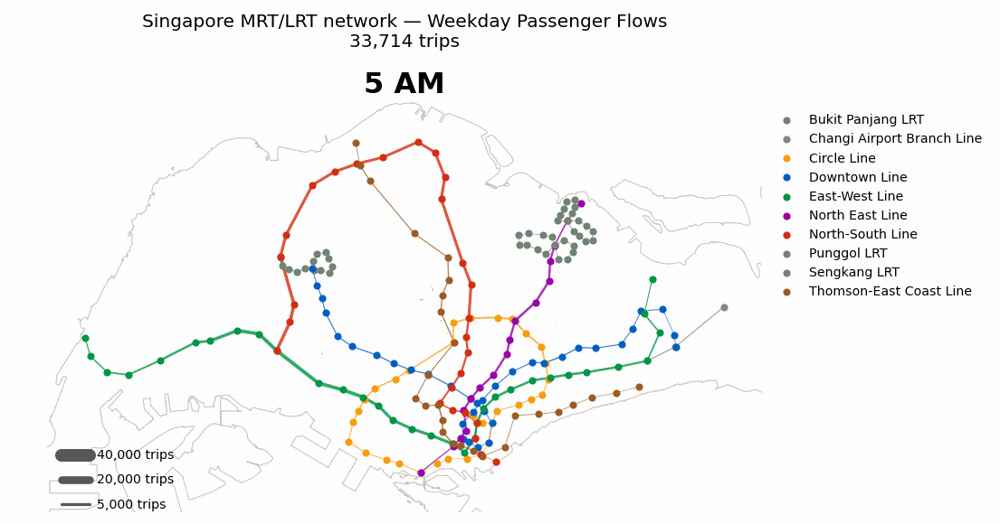

## 1. Introduction

At its core, every rail network can be conceptualised as a graph — stations as nodes, tracks as edges. This simple conceptualisation yields significant analytical power through the mathematical and computational tools provided by the field of [network science](https://networksciencebook.com/){target="_blank"}. It allows us to model how passengers navigate transit systems, spot hidden single points of failure, and stress-test disruptions before they occur in the real world.

The utility of this approach grows with what we embed in the graph. A purely topological graph captures basic connectivity and network structure. Incorporating distance between nodes introduces spatial routing. Adding travel times and transfer penalties captures frictions that shape passenger decisions. Finally, layering on actual passenger flows creates a realistic model of how the system is used day to day.

This technical annex builds that model layer by layer for Singapore's rail system — mapping its topology, weighting it with travel times, and grounding it in observed passenger flows to produce a useful tool for investigation and analysis.

## 2. Data Ingredients

Here's a quick overview of the data that's required to build this graph and why it is needed. 

| Source | Dataset | Role in the Graph |
|:-----------------|:----------------------|:-------------------------------|
| [OpenStreetMap (Overpass API)](https://wiki.openstreetmap.org/wiki/Singapore/Rail_Transport "OSM Wiki") | Route relations, station sequences, track geometry | Topological skeleton — nodes, edges, and physical edge lengths |
| [Data.gov.sg](https://data.gov.sg/datasets/d_d312a5b127e1ae74299b8ae664cedd4e/view) | Train station codes reference | Ground truth for line codes; used to validate OSM topology & resolve interchanges |
| [LTA DataMall](https://datamall.lta.gov.sg/content/datamall/en/dynamic-data.html#Public%20Transport) | GTFS Schedule (Train) feed | Scheduled inter-station running times (`stop_times`, `trips`, `calendar`) |
| [LTA DataMall](https://datamall.lta.gov.sg/content/datamall/en/dynamic-data.html#Public%20Transport) | Passenger Volume by Origin-Destination (`PV/ODTrain`) | Hourly trip counts between station pairs by day type (demand matrix) |
| [Reddit user u/catcourtesy](https://docs.google.com/spreadsheets/d/1e-Tuf6rHBFsgsuFN7XqbFL8ec_vdRjQw/edit?gid=459175256#gid=459175256) | Interchange transfer times dataset | Platform-to-platform transfer times at all interchange stations |
| [URA Master Plan 2025](https://data.gov.sg/datasets/d_2cc750190544007400b2cfd5d7f53209/view) | Planning Area Boundary | Geographic context for visualization only (not part of graph structure) |


## 3. Building the Network Graph

#### Step 1: Constructing the topological skeleton from OpenStreetMap (OSM)

Each MRT/LRT line in OSM exists as a *route relation*, which is an ordered sequence of station stops with the way geometry connecting them. Specifically, we are interested in obtaining the coordinates of each station (nodes), the lines connecting each station (ways) and the order in which they are connected (relations). Parsing each route relation in order and stitching the resulting station sequence together produces the network's raw topology, i.e. which station connects to which, and how far apart they are.

::: {.callout-note title="Understanding OSM data"}
**OpenStreetMap** models the physical world using *three* fundamental building blocks:

-   **Node:** A single point defined by latitude and longitude (e.g., a station entrance, signal light, or amenity).
-   **Way:** An ordered sequence of nodes that forms a line (e.g., a rail track segment) or a closed polygon (e.g., a station building).
-   **Relation:** A group that links nodes and ways to define complex systems (e.g., train route composed of multiple physical tracks and station stops).
:::

To obtain the relevant data from OSM, the *overpass API* was queried for routes with the following *tags* (train, subway, light rail, monorail), within the Singapore area boundary. In total, after excluding the Jurong Regional Line, Sentosa Express and Airport Skytrain, 26 route relations covering the full MRT/LRT network were obtained. 

```{python}
#| echo: false
#| warning: false
#| output: false
#| label: Load libraries 
import os
import re
import io
import json
import zipfile
import warnings
from pathlib import Path

import requests
import numpy as np
import pandas as pd
import geopandas as gpd
import networkx as nx
import pyproj
from shapely.geometry import Point, LineString
from scipy.spatial import cKDTree

warnings.filterwarnings('ignore')
print('Libraries loaded ✓')
```

```{python}
#| echo: false
#| warning: false
#| output: false
#| label: Load Configuation
# Base working directory
BASE_DIR = Path(r"C:\Users\benja\Documents\CASA\CASA\Projects\projects\Singapore-Rail-Network")

# Define Data and Output directories
DATA_DIR = BASE_DIR / "data"
OUTPUT_DIR = BASE_DIR / "output"

# Create directories if they do not exist
DATA_DIR.mkdir(parents=True, exist_ok=True)
OUTPUT_DIR.mkdir(parents=True, exist_ok=True)

# -- CRS --
OSM_CRS = 'EPSG:4326'   # OSM's native lat/lon
TARGET_CRS = 'EPSG:3414'   # SVY21 -- Benjamin's explicit choice, used throughout
transformer = pyproj.Transformer.from_crs(OSM_CRS, TARGET_CRS, always_xy=True)

# -- LTA DataMall --
LTA_API_KEY = (DATA_DIR / 'lta_api_key.txt').read_text().strip()

# -- Overpass (OSM) --
OSM_CACHE_PATH = DATA_DIR / 'osm_overpass_cache.json'

OVERPASS_MIRRORS = [
    'https://z.overpass-api.de/api/interpreter',
    'https://overpass.private.coffee/api/interpreter',
]
OVERPASS_HEADERS = {
    'User-Agent': 'singapore-mrt-network-graph/0.2 (personal research project)',
    'Accept': 'application/json',
}
OVERPASS_QUERY = """
[out:json][timeout:90];
area["ISO3166-1"="SG"][admin_level=2]->.sg;
(
  relation["route"="train"](area.sg);
  relation["route"="subway"](area.sg);
  relation["route"="light_rail"](area.sg);
  relation["route"="monorail"](area.sg);
);
(._;>;);
out geom;
"""

# Relations to drop before building anything -- confirmed in the old file's §1.5:
# Jurong Region Line isn't operational yet (delayed to mid-2028; OSM mapped the
# alignment ahead of the real service), and Sentosa Express / Skytrain are real
# but aren't part of the MRT/LRT network (a separate island shuttle and Changi's
# inter-terminal people-mover).
EXCLUDE_REFS = {'Sentosa Express', 'Skytrain'}
EXCLUDE_NAME_MATCH = 'Jurong Regional'

# our codes-table line names -> the OSM `ref` they correspond to
CODES_LINE_TO_OSM_REF = {
    'North-South Line': 'NSL', 'East-West Line': 'EWL', 'Changi Airport Branch Line': 'EWL',
    'North East Line': 'NEL', 'Circle Line': 'CCL', 'Circle Line Extension': 'CCL',
    'Downtown Line': 'DTL', 'Thomson-East Coast Line': 'TEL',
    'Sengkang LRT': 'SKLRT', 'Punggol LRT': 'PGLRT', 'Bukit Panjang LRT': 'BPLRT',
}

SNAP_TOL = 60   # metres -- a station this far from its matched point on a relation's
# stitched line likely fell on a way fragment that didn't stitch in
print('Config loaded ✓')
```

```{python}
#| echo: false
#| warning: false
#| output: false
#| label: osm-fetch
# OSM query: station coordinates, sequences, and line geometry
def fetch_osm(force_refresh=False):
    if OSM_CACHE_PATH.exists() and not force_refresh:
        with open(OSM_CACHE_PATH, 'r', encoding='utf-8') as f:
            osm = json.load(f)
        print(f'Loaded cached OSM data from {OSM_CACHE_PATH} '
              f'({OSM_CACHE_PATH.stat().st_size / 1e6:.1f} MB) -- pass force_refresh=True to re-fetch')
        return osm
    for url in OVERPASS_MIRRORS:
        try:
            resp = requests.post(
                url, data={'data': OVERPASS_QUERY}, headers=OVERPASS_HEADERS, timeout=180)
            resp.raise_for_status()
            osm = resp.json()
            print(f'Success via {url}')
            with open(OSM_CACHE_PATH, 'w', encoding='utf-8') as f:
                json.dump(osm, f)
            print(f'Cached to {OSM_CACHE_PATH}')
            return osm
        except requests.exceptions.RequestException as e:
            print(f'  {url} failed: {e}')
    raise RuntimeError(
        'All Overpass mirrors failed -- see printed errors above')


osm = fetch_osm()

rels = {e['id']: e for e in osm['elements'] if e['type'] == 'relation'}
nodes = {e['id']: e for e in osm['elements'] if e['type'] == 'node'}
ways = {e['id']: e for e in osm['elements'] if e['type'] == 'way'}
print(f'Relations: {len(rels)}   Nodes: {len(nodes)}   Ways: {len(ways)}')

mrt_lrt_rels = {
    rid: r for rid, r in rels.items()
    if r['tags'].get('ref') not in EXCLUDE_REFS
    and EXCLUDE_NAME_MATCH not in r['tags'].get('name', '')
}
print(f'{len(mrt_lrt_rels)} relations kept (of {len(rels)}) '
      f'after excluding JRL / Sentosa Express / Skytrain / CE extension')
```

```{python}
#| label: tbl-lines
#| warning: false
#| tbl-cap: "MRT and LRT route relations retained from OSM, by line and direction"
#| echo: false
from IPython.display import Markdown, display

# "MRT East-West Line (Tuas Link → Pasir Ris)" -> ('MRT', 'East-West Line', 'Tuas Link → Pasir Ris')
NAME_RE = re.compile(r'^(MRT|LRT)\s+(.*?)(?:\s+\((.*)\))?$')
BP_RE   = re.compile(r'^(.*Line) ([AB])$')   # Bukit Panjang encodes its services in the line name

def parse_name(name):
    system, line, variant = NAME_RE.match(name).groups()
    if (m := BP_RE.match(line)):             # no parenthetical: lift A/B into the variant
        line, variant = m.group(1), f'Service {m.group(2)}'
    return system, line, variant or ''

df = pd.DataFrame(
    [dict(zip(('System', 'Line', 'Direction'), parse_name(r['tags']['name'])))
     for r in mrt_lrt_rels.values()]
)

# MRT before LRT (descending puts 'MRT' first), then alphabetical by line.
summary = (df.sort_values(['System', 'Line'], ascending=[False, True])
             .groupby(['System', 'Line'], sort=False)
             .agg(**{'#': ('Direction', 'size'),
                     'Directions': ('Direction', lambda s: ' · '.join(sorted(s)))})
             .reset_index())

# Totals row appended as data so it renders inside the same markdown table.
totals = pd.DataFrame([{'System': '', 'Line': '**Total**',
                        '#': f"**{summary['#'].sum()}**", 'Directions': ''}])
summary['#'] = summary['#'].astype(str)

display(Markdown(pd.concat([summary, totals], ignore_index=True)
                   .to_markdown(index=False, colalign=('left', 'left', 'right', 'left'))))
```

#### Step 2: Validating sequences using LTA data on station locations

A map is only as good as it is accurate. Fortunately, OSM data in Singapore is pretty well-established, and the data accurately mirrors official sources, with the latest network improvements [(e.g. closing of circle-line loop in Jul 2026)](https://www.channelnewsasia.com/singapore/circle-line-cantonment-price-edward-road-keppel-mrt-stations-first-look-6172836). Station codes and sequences were checked against official data from LTA to derive the system map:

_CCL6.png)

Comparing OSM station coordinates against official station centroids, the average difference of 30m across all stations is reasonably small, with the largest difference coming just under 200m. Pretty accurate! Now, we are ready to assemble the graph.

```{python}
#| echo: false
#| warning: false
#| output: false
#| label: parsing-functions
## 2.0. Set up relations parsing functions

GAP_TOL = 50.0   # metres; endpoints this close are the same junction mapped twice

def relation_line(rel):
    """Stitch a relation's track ways into a LineString (SVY21).

    Only unroled way members carry track geometry -- role='platform'/'stop' ways are
    station furniture that shares no endpoint with the rails.

    Builds every maximal chain rather than growing one from the first member: a
    relation whose ways aren't in traversal order, or which has a single break,
    otherwise orphans everything downstream of the break. Chains are then joined at
    their nearest free endpoints when the gap is under GAP_TOL.

    Returns (line, n_unjoined_vertices, max_gap_m).
    """
    segs = []
    for m in rel['members']:
        if m['type'] != 'way' or m.get('role'):
            continue
        w = ways.get(m['ref'])
        if w and 'geometry' in w:
            segs.append([transformer.transform(p['lon'], p['lat']) for p in w['geometry']])
    if not segs:
        return None, 0, 0.0

    chains, remaining = [], segs[:]
    while remaining:
        chain, changed = remaining.pop(0)[:], True
        while remaining and changed:                  # absorb whatever still fits
            changed = False
            for i, seg in enumerate(remaining):
                # OSM way direction is arbitrary relative to travel direction, so each
                # segment is oriented by whichever endpoint it shares with the chain.
                if   np.allclose(chain[-1], seg[0],  atol=1): chain += seg[1:]
                elif np.allclose(chain[-1], seg[-1], atol=1): chain += seg[::-1][1:]
                elif np.allclose(chain[0],  seg[-1], atol=1): chain = seg[:-1] + chain
                elif np.allclose(chain[0],  seg[0],  atol=1): chain = seg[::-1][:-1] + chain
                else:
                    continue
                remaining.pop(i); changed = True; break
        chains.append(chain)

    # Join chains at nearest free endpoints, longest first, flipping as needed.
    # Sort by ground distance, not vertex count: a densely-noded curve through a
    # station would otherwise outrank a sparse multi-kilometre straight.
    chain_len = lambda c: sum(np.hypot(b[0] - a[0], b[1] - a[1]) for a, b in zip(c, c[1:]))
    chains.sort(key=chain_len, reverse=True)
    merged, max_gap = chains.pop(0), 0.0
    while chains:
        gap, j, ea, eb = min(
            ((np.hypot(*(np.array(a) - np.array(b))), j, ea, eb)
             for j, c in enumerate(chains)
             for ea, a in ((0, merged[0]), (1, merged[-1]))
             for eb, b in ((0, c[0]), (1, c[-1]))),
            key=lambda t: t[0])
        if gap > GAP_TOL:
            break
        c = chains.pop(j)
        if eb == 1: c = c[::-1]
        merged = (merged + c) if ea == 1 else (c[::-1] + merged)
        max_gap = max(max_gap, gap)

    n_unjoined = sum(len(c) for c in chains)
    return LineString(merged), n_unjoined, max_gap


def station_sequence_with_coords(rel):
    """Stops of a route relation in travel order, projected to SVY21. PTv2 member
    order is already the sequence, so no sorting is needed."""
    seq = []
    for m in rel['members']:
        if m['type'] == 'node' and m.get('role', '').startswith('stop'):
            n = nodes.get(m['ref'])
            if n and n.get('tags', {}).get('name'):
                x, y = transformer.transform(n['lon'], n['lat'])
                seq.append({'name': n['tags']['name'], 'x': x, 'y': y})
    return seq


def orient_line_to_sequence(line, seq):
    """relation_line() stitches from an arbitrary starting way, so the chain can run
    in either direction relative to the stop sequence. Detect it with a coarse
    line.project() comparison of two well-separated stops (2nd/2nd-last for closed
    loops, since the true first/last coordinates are identical there) and reverse if
    needed -- otherwise project_sequential's forward-only search silently drifts."""
    if len(seq) < 3:
        return line
    is_loop = seq[0]['name'] == seq[-1]['name']
    i_first, i_last = (1, -2) if is_loop else (0, -1)
    p_first = Point(seq[i_first]['x'], seq[i_first]['y'])
    p_last = Point(seq[i_last]['x'], seq[i_last]['y'])
    if line.project(p_first) > line.project(p_last):
        return LineString(list(line.coords)[::-1])
    return line


def project_sequential(line, seq):
    """Project each station onto `line` IN SEQUENCE ORDER, always searching forward
    from the previous station's matched point -- resolves closed-loop/lollipop
    relations that revisit the same physical coordinates (e.g. a loop's hub station
    at both sequence start and end), which a plain nearest-point line.project() would
    silently corrupt. Returns (positions, snap_dists)."""
    coords = np.array(line.coords)
    seg_vec = coords[1:] - coords[:-1]
    seg_len = np.hypot(seg_vec[:, 0], seg_vec[:, 1])
    cum = np.concatenate([[0.0], np.cumsum(seg_len)])
    positions, snap_dists = [], []
    start_idx = 0
    for s in seq:
        p = np.array([s['x'], s['y']])
        best_dist, best_pos, best_idx = np.inf, None, start_idx
        for i in range(start_idx, len(coords) - 1):
            a, b = coords[i], coords[i + 1]
            ab = b - a
            L2 = ab @ ab
            t = 0.0 if L2 == 0 else np.clip((p - a) @ ab / L2, 0, 1)
            proj = a + t * ab
            d = float(np.hypot(*(p - proj)))
            if d < best_dist:
                best_dist, best_pos, best_idx = d, cum[i] + t * seg_len[i], i
        positions.append(best_pos)
        snap_dists.append(best_dist)
        start_idx = best_idx
    return positions, snap_dists


def relation_edges(rel):
    """The core of the OSM-primary approach: return this relation's consecutive-stop
    pairs as (name_a, name_b, coords_a, coords_b, distance_m). A relation whose ways
    don't fully stitch is dropped outright rather than warned about -- a partial
    polyline still yields plausible-looking distances for whichever stations happen to
    fall on it, which is harder to catch than an outright failure."""
    line, n_unjoined, max_gap = relation_line(rel)
    if line is None:
        return []
    if n_unjoined:
        print(f"  ERROR: {n_unjoined} unjoined vertices for {rel['tags'].get('name')} "
              f"-- skipping relation")
        return []
    if max_gap > 1:
        print(f"  note: bridged {max_gap:.0f}m endpoint gap in {rel['tags'].get('name')}")

    seq = station_sequence_with_coords(rel)
    line = orient_line_to_sequence(line, seq)
    positions, snap_dists = project_sequential(line, seq)

    out = []
    for i in range(len(seq) - 1):
        if snap_dists[i] > SNAP_TOL or snap_dists[i + 1] > SNAP_TOL:
            print(f"    skip {seq[i]['name']} <-> {seq[i+1]['name']}: snap dist "
                  f"{snap_dists[i]:.0f}m/{snap_dists[i+1]:.0f}m > {SNAP_TOL}m "
                  f"in {rel['tags'].get('name')}")
            continue
        a, b = seq[i], seq[i + 1]
        out.append((a['name'], b['name'], (a['x'], a['y']), (b['x'], b['y']),
                    round(abs(positions[i + 1] - positions[i]), 1)))
    return out

print('Relation-parsing functions ready ✓')
```

```{python}
#| echo: false
#| warning: false
#| output: false
#| label: lta-load
## 2.1. Load LTA data for verification 
codes = pd.read_csv(DATA_DIR / 'Train_Station_Codes.csv')
codes['mrt_line_english']    = codes['mrt_line_english'].str.strip()
codes['mrt_station_english'] = codes['mrt_station_english'].str.strip()
codes['stn_code']            = codes['stn_code'].str.strip()

CCL6_STATIONS = [
    ('CC30', 'Keppel', 'Circle Line'),
    ('CC31', 'Cantonment', 'Circle Line'),
    ('CC32', 'Prince Edward Road', 'Circle Line'),
]
for code, name, line in CCL6_STATIONS:
    if code not in codes['stn_code'].values:
        codes.loc[len(codes)] = {'stn_code': code, 'mrt_station_english': name, 'mrt_line_english': line}

RENUMBERED = {'CE1': ('CC33', 'Circle Line'), 'CE2': ('CC34', 'Circle Line')}
for old_code, (new_code, new_line) in RENUMBERED.items():
    mask = codes['stn_code'] == old_code
    codes.loc[mask, 'stn_code'] = new_code
    codes.loc[mask, 'mrt_line_english'] = new_line

stn_shp = gpd.read_file(DATA_DIR / 'RapidTransitSystemStation.shp')  # SVY21 natively
def parse_station(desc):
    m = re.match(r'^(.*)\s+(MRT|LRT)\s+STATION$', str(desc).strip(), re.IGNORECASE)
    return (m.group(1).strip(), m.group(2).upper()) if m else (str(desc).strip(), None)
parsed = stn_shp['STN_NAM_DE'].apply(parse_station)
stn_shp['station']  = parsed.apply(lambda x: x[0])
stn_shp['sys_type'] = parsed.apply(lambda x: x[1])
lta_stations = stn_shp[stn_shp['sys_type'].notna()].copy()
lta_stations['x'] = lta_stations.geometry.centroid.x
lta_stations['y'] = lta_stations.geometry.centroid.y

def norm(name):
    n = str(name).upper().strip().replace("'", "").replace("’", "")
    n = re.sub(r'[^A-Z0-9]+', ' ', n)
    return re.sub(r'\s+', ' ', n).strip()

codes['name_norm'] = codes['mrt_station_english'].apply(norm)
lta_stations['name_norm'] = lta_stations['station'].apply(norm)
lta_coord_by_name = lta_stations.groupby('name_norm')[['x', 'y']].mean()
```

```{python}
#| echo: false
#| warning: false
#| label: tbl-osm-lta
#| tbl-cap: "Difference between LTA and OSM data for station centroids (Top 5)"

# 2.2 Check station distances against known station distances
name_to_code = {}
for code, grp in codes.groupby('stn_code'):
    row = grp.iloc[0]
    ref = CODES_LINE_TO_OSM_REF.get(row['mrt_line_english'], row['mrt_line_english'])
    name_to_code[(ref, row['mrt_station_english'])] = code

CODE_HINT_RE = re.compile(r'^(.*?)\s*\(([A-Z]{1,3}\d+)\)$')
valid_codes = set(codes['stn_code'])

# OSM's Sengkang LRT loop relations close each loop against a synthetic anchor node
# ("Sengkang - West Loop Clockwise" etc.) instead of tagging the real 'Sengkang' hub
# station as the loop's closing stop
NAME_ALIASES = {
    'Sengkang - West Loop Clockwise': 'Sengkang', 'Sengkang - East Loop Clockwise': 'Sengkang',
    'Sengkang - West Loop Anticlockwise': 'Sengkang', 'Sengkang - East Loop Anticlockwise': 'Sengkang',
}

def resolve_osm_name(osm_name, ref):
    """Prefer a code embedded directly in the OSM name (e.g. 'Tampines (EW2)' -> EW2,
    if EW2 is a real code), otherwise fall back to (ref, plain-name) table lookup
    (after resolving any known loop-anchor alias)."""
    osm_name = NAME_ALIASES.get(osm_name, osm_name)
    m = CODE_HINT_RE.match(osm_name)
    if m and m.group(2) in valid_codes:
        return m.group(2)
    base_name = m.group(1) if m else osm_name
    return name_to_code.get((ref, base_name))

# QA: coordinate cross-check, OSM vs LTA shapefile, for every stop we can resolve
rows = []
for rid, r in mrt_lrt_rels.items():
    ref = r['tags'].get('ref')
    for s in station_sequence_with_coords(r):
        code = resolve_osm_name(s['name'], ref)
        if code is None:
            continue
        lta_row = lta_coord_by_name[lta_coord_by_name.index == norm(s['name'].split(' (')[0])]
        if lta_row.empty:
            continue
        d = float(np.hypot(s['x'] - lta_row['x'].iloc[0], s['y'] - lta_row['y'].iloc[0]))
        rows.append({'code': code, 'name': s['name'], 'osm_lta_dist_m': d})

qa = pd.DataFrame(rows).drop_duplicates('code')

# Strip any "(CC1)" suffix so the name column doesn't repeat the code column.
top5 = (qa.nlargest(5, 'osm_lta_dist_m')
          .assign(name=lambda d: d['name'].str.replace(r'\s*\([A-Z]{1,3}\d+\)$', '', regex=True),
                  osm_lta_dist_m=lambda d: d['osm_lta_dist_m'].round(1))
          .rename(columns={'code': 'Station Code',
                           'name': 'Station Name',
                           'osm_lta_dist_m': 'Difference (m)'}))

display(Markdown(top5.to_markdown(index=False, colalign=('left', 'left', 'right'))))
```

#### Step 3: Assemble undirected graph with stations as nodes and tracks as edges

```{python}
#| echo: false
#| warning: false
#| output: false
#| label: graph-build
## 3.0. Assemble the undirected station graph

# CE-extension services (Dhoby Ghaut <-> Prince Edward Road) duplicate loop track and
# would double-count in the line summary. They are NOT redundant for the graph: since
# the CCL6 closure the loop runs Promenade -> ... -> Bayfront -> Promenade, leaving
# CC1-CC3 (Dhoby Ghaut, Bras Basah, Esplanade) on a spur these relations alone serve.
graph_rels = {
    rid: r for rid, r in rels.items()
    if r['tags'].get('ref') not in EXCLUDE_REFS
    and EXCLUDE_NAME_MATCH not in r['tags'].get('name', '')
}
mrt_lrt_rels = {
    rid: r for rid, r in graph_rels.items()
    if 'Prince Edward Road' not in r['tags'].get('name', '')
}
print(f'{len(graph_rels)} relations for the graph; {len(mrt_lrt_rels)} for the line summary')

G = nx.Graph()
edge_samples, skipped_names = {}, set()

# Built from graph_rels, not mrt_lrt_rels: the CE-extension relations are excluded
# from the line summary as duplicate track, but since the CCL6 closure they are the
# only relations serving CC1-CC3 (Dhoby Ghaut, Bras Basah, Esplanade), which sit on a
# spur off Promenade rather than on the loop itself.
for rid, r in graph_rels.items():
    ref = r['tags'].get('ref')
    for name_a, name_b, xy_a, xy_b, dist in relation_edges(r):
        ca, cb = resolve_osm_name(name_a, ref), resolve_osm_name(name_b, ref)
        if ca is None:
            skipped_names.add(name_a)
        if cb is None:
            skipped_names.add(name_b)
        if ca is None or cb is None or ca == cb:
            continue
        for code, xy in [(ca, xy_a), (cb, xy_b)]:
            if code not in G:
                row = codes.loc[codes['stn_code'] == code].iloc[0]
                G.add_node(code, station=row['mrt_station_english'],
                           line=row['mrt_line_english'], x=xy[0], y=xy[1])
        edge_samples.setdefault(frozenset({ca, cb}), []).append(dist)

# One Downtown Line direction is unusable (a 16.6 km gap in the OSM way geometry), so
# some edges are measured once and others averaged across both directions. Record
# n_samples and spread on the edge -- a printed warning alone can't be filtered on
# downstream, and a single-sample edge has no cross-direction check behind it.
n_flagged = 0
for key, dists in edge_samples.items():
    ca, cb = tuple(key)
    spread = (max(dists) - min(dists)) if len(dists) > 1 else 0.0
    if len(dists) > 1 and spread > 0.15 * np.mean(dists):
        print(f'  disagreement for {G.nodes[ca]["station"]} <-> {G.nodes[cb]["station"]}: {dists}')
        n_flagged += 1
    G.add_edge(ca, cb, length_m=round(float(np.mean(dists)), 1),
               n_samples=len(dists), spread_m=round(float(spread), 1),
               dist_source='osm_way_geometry')

print(f'{len(skipped_names)} distinct OSM stop names never resolved to a code: '
      f'{sorted(skipped_names)[:20]}')
print(f'{n_flagged} edges flagged for >15% cross-relation disagreement')

# Interchange edges: same station name, different line codes. A transfer isn't a
# "stop" on either line, so it never appears in any relation's sequence and needs
# its own pass.
for name, grp in codes.groupby('mrt_station_english'):
    cs = [c for c in grp['stn_code'] if c in G]
    for i in range(len(cs)):
        for j in range(i + 1, len(cs)):
            if not G.has_edge(cs[i], cs[j]):
                G.add_edge(cs[i], cs[j], length_m=0.0, n_samples=0, spread_m=0.0,
                           dist_source='interchange')

n_comp = nx.number_connected_components(G)
print(f'\nNodes: {G.number_of_nodes()}   Edges: {G.number_of_edges()}   Components: {n_comp}')
print(pd.Series([d['dist_source'] for _, _, d in G.edges(data=True)]).value_counts())
print('codes never reaching G:', sorted(set(codes['stn_code']) - set(G.nodes)))

# Plausibility check standing in for the cross-relation comparison on single-sample
# edges: real MRT/LRT inter-station spacing sits well inside 200 m - 4 km.
odd = [(a, b, d['length_m']) for a, b, d in G.edges(data=True)
       if d['dist_source'] == 'osm_way_geometry' and not 200 <= d['length_m'] <= 4000]
print(f'{len(odd)} edges outside 200m-4km:', odd[:10])

if n_comp > 1:
    print('\nMore than 1 component -- listing each so we can see what fell off:')
    for comp in sorted(nx.connected_components(G), key=len, reverse=True):
        names = sorted({G.nodes[c]['station'] for c in comp})
        print(f'  {len(comp)} nodes: {names[:8]}{"..." if len(names) > 8 else ""}')

# Adjustment for Tanah Merah which has station code as CG rather than CGX
if 'CG' not in codes['stn_code'].values:
    codes.loc[len(codes)] = {'stn_code': 'CG', 'mrt_station_english': 'Tanah Merah',
                              'mrt_line_english': 'Changi Airport Branch Line'}

if G.has_edge('EW4', 'CG1') and G['EW4']['CG1']['dist_source'] != 'interchange':
    d = G['EW4']['CG1']
    G.add_node('CG', station='Tanah Merah', line='Changi Airport Branch Line',
               x=G.nodes['EW4']['x'], y=G.nodes['EW4']['y'])
    G.add_edge('CG', 'CG1', length_m=d['length_m'], dist_source=d['dist_source'])
    G.add_edge('EW4', 'CG', length_m=0.0, dist_source='interchange')
    G.remove_edge('EW4', 'CG1')
    print(f"Split EW4<->CG1 ({d['length_m']:,.0f} m) into CG<->CG1 (real track) + EW4<->CG (interchange)")
else:
    print('EW4<->CG1 not found as expected -- check before assuming this applied')

```

The graph is built with [NetworkX](https://networkx.org/en/), a Python library for creating and analysing networks. Each station code is stored as a node, placed at its OpenStreetMap coordinates. Stations that are consecutive stops on a route relation are joined by a track edge, which is weighted by the distance measured along the stitched line geometry, which gives the true track distance rather than a straight line. To account for interchanges,zero-length edges we addded between every set of nodes that share a station name. For example, each Dhoby Ghaut station on the Circle Line, North East Line and North South Line were retained, and connected to one another with zero-length edges to account for passenger transfers. These carry no distance, but are given a real travel time in Step 4.

The result is a single connected graph of *`{python} G.number_of_nodes()` nodes* and *`{python} G.number_of_edges()` edges* covering the full MRT and LRT network. Plotting it allows us to check that everything is in order.

::: {.panel-tabset}

## Schematic

```{python}
#| echo: false
#| warning: false
#| label: fig-network-static
#| fig-cap: "Singapore MRT/LRT network, stations coloured by line"

import matplotlib.pyplot as plt

COLOR_MAP = {
    "Bukit Panjang LRT": "#708372",
    "Circle Line": "#fa9e0d",
    "Downtown Line": "#005ec4",
    "Thomson-East Coast Line": "#9D5B25",
    "East-West Line": "#009645",
    "North East Line": "#9900aa",
    "North-South Line": "#d42e12",
    "Punggol LRT": "#708372",
    "Sengkang LRT": "#708372",
}

fig, ax = plt.subplots(figsize=(20, 16))

lines = sorted(set(nx.get_node_attributes(G, "line").values()))
pos = {n: (G.nodes[n]["x"], G.nodes[n]["y"]) for n in G.nodes}

# Dotted edges mark interchanges (zero-length transfers), solid edges real track.
for u, v, d in G.edges(data=True):
    style = ":" if d["dist_source"] == "interchange" else "-"
    ax.plot([pos[u][0], pos[v][0]], [pos[u][1], pos[v][1]],
            style, color="#888", lw=1.2, zorder=1)

for ln in lines:
    ns = [n for n in G.nodes if G.nodes[n]["line"] == ln]
    xs, ys = zip(*[pos[n] for n in ns])
    ax.scatter(xs, ys, s=45, color=COLOR_MAP.get(
        ln, "#888888"), label=ln, zorder=2)

ax.set_aspect("equal")
ax.axis("off")
ax.legend(fontsize=14, loc="upper left", bbox_to_anchor=(1, 1), frameon=False)
ax.set_title(f"Singapore MRT/LRT — {G.number_of_nodes()} nodes, "
             f"{G.number_of_edges()} edges", fontsize=18, pad=20)

plt.tight_layout()
plt.show()
```

## Interactive

```{python}
#| echo: false
#| warning: false
#| label: fig-network-folium
#| fig-cap: "Singapore MRT/LRT network, stations coloured by line"

import folium
import pyproj

PALETTE_HEX = {
    "Bukit Panjang LRT": "#708372",
    "Circle Line": "#fa9e0d",
    "Downtown Line": "#005ec4",
    "Thomson-East Coast Line": "#9D5B25",
    "East-West Line": "#009645",
    "North East Line": "#9900aa",
    "North-South Line": "#d42e12",
    "Punggol LRT": "#708372",
    "Sengkang LRT": "#708372",
}

transformer_inv = pyproj.Transformer.from_crs(
    TARGET_CRS, OSM_CRS, always_xy=True)


def to_latlon(x, y):
    lon, lat = transformer_inv.transform(x, y)
    return lat, lon


# Fixed centre and zoom rather than fit_bounds: Leaflet derives a fit_bounds zoom
# from the container size, which is unreliable before the container has been
# measured. Zoom 11 spans Tuas Link to Changi Airport at this width.
# tiles=None then an explicit TileLayer, because the tiles= shortcut takes no
# opacity kwarg.
m = folium.Map(location=[1.352, 103.820], zoom_start=11,
               tiles=None, width='100%', height='600px')
folium.TileLayer(
    "OpenStreetMap", opacity=0.8,
    # Attribution must be restated when the layer is added explicitly.
    attr='&copy; <a href="https://www.openstreetmap.org/copyright">OpenStreetMap</a> contributors',
).add_to(m)

# One polyline per edge rather than per line: a DFS traversal visits each node once,
# so it stops one edge short of closing a loop, and it jumps at branch points
# (EW's Changi branch, CC's CC1-CC3 spur). The LRT lines are two loops sharing a hub
# and can't be represented as a single ordered sequence at all.
# Interchange edges are zero-length transfers with no track geometry, so skip them.
for u, v, d in G.edges(data=True):
    if d['dist_source'] == 'interchange':
        continue
    ln = G.nodes[u]['line']
    folium.PolyLine(
        [to_latlon(G.nodes[u]["x"], G.nodes[u]["y"]),
         to_latlon(G.nodes[v]["x"], G.nodes[v]["y"])],
        color=PALETTE_HEX.get(ln, "#333333"),
        weight=3.5, opacity=0.85, tooltip=ln,
    ).add_to(m)

for n, data in G.nodes(data=True):
    lat, lon = to_latlon(data["x"], data["y"])
    node_color = PALETTE_HEX.get(data.get("line"), "#333333")
    folium.CircleMarker(
        location=[lat, lon], radius=4, color=node_color,
        fill=True, fill_color=node_color, fill_opacity=0.9, weight=1,
        tooltip=f"{data.get('station', n)} ({n}) — {data.get('line', 'Unknown')}",
    ).add_to(m)

m.save(str(OUTPUT_DIR / "network_map.html"))
m
```

:::

#### Step 4: Add on travel times using GTFS schedule for realistic routing 

*Travel times between stations* 

To accurately assign passenger flows within the network, an objective measure of how passengers might likely travel, given an origin, and destination station is needed

A suitable measure is the **total travel duration** of the trip. Passengers desire to minimise travel times to their destination, and naturally select the *fastest* route between origin and destination stations. Passengers intuitively refer to Google Maps or Citymapper to find the shortest time taken to get between A and B, and so this is a representative way to model passenger behaviour and choice. Other options include optimising for *physical track distance* or *travel cost*, but both feature less prominently in the decision-making process. Moreover, Singapore adopts a [*distance-based charging approach*](https://www.ptc.gov.sg/fares/distance-fares-and-transfer-rules/){target="_blank"} to ensure that passengers are charged based on their actual usage of the transport network, so the difference in prices between different routes to the same destination is minimal.

To obtain the travel times between adjacent stations in the network, we can tap on the very useful unified GTFS schedule provided by LTA via DataMall. While this can simply be obtained through the station boards encountered at station platforms, the GTFS schedule provides travel durations specific to train schedules at different periods of the day, which enables more accurate modelling. 

](travel_timings.jpeg)

::: {.callout-note title="Understanding GTFS schedule data"}
**GTFS** (General Transit Feed Specification) is the standard format agencies publish timetables in. Two parts matter:

-   **Routes and stops:** A *stop* is a place passengers board, and a *route* is a named service (e.g. the East-West Line). A *trip* is one vehicle running that route once, and *stop times* record when it calls at each stop in order — so the station sequence comes from the timetable itself rather than from a map.
-   **Schedules and frequencies:** Departures are given either as explicit clock times for every trip, or as a *headway* — one trip every few minutes between set hours. 

In Singapore, this data comes from **LTA DataMall**, which aggregates travel time information across the major operators SMRT and SBS Transit. The GTFS describes the *planned* timetable, not observed operation.
:::

*Time taken for interchange transfers* 

Another piece of information needed to construct an accurate network is the *time taken for transfers at interchange stations*. Singapore has approximately 30 train interchange stations. However, not all interchanges were built the same. Earlier ones like City Hall and Raffles Place were constructed with transfers in mind with platforms opposite each other or one short escalator ride away. Newer interchange stations like Bugis, Buona Vista and Woodlands require passengers to walk longer distances for connecting trains. Fortunately, we have this data courtesy of Reddit user [u/catcourtesy](https://www.reddit.com/r/SingaporeRaw/comments/zmiboc/mrt_map_with_transfer_timing/), who measured each transfer timing between platforms of different lines by walking through the actual transfers. In reality, transfers also include the waiting time for the train on the next line. To account for this, 3 minutes were added on average for all transfers.

*Shortest total travel duration* 

By combining travel time between stations and transfer times within interchange stations, a realistic graph network for the MRT/LRT system can be built. [Dijkstra’s algorithm](https://www.geeksforgeeks.org/dsa/dijkstras-shortest-path-algorithm-greedy-algo-7/) was applied to find the shortest path between two stations, which can then be used to derive the most rational route with transfers, and allocate passenger flows between origin and destination stations accordingly. 

```{python}
#| echo: false
#| warning: false
#| output: false
#| label: load-GTFS-data
## Load GTFS data
GTFS_ZIP_PATH = DATA_DIR / 'gtfs_schedule_train.zip'

def fetch_gtfs_train(force_refresh=False):
    """LTA's GTFS Schedule (Train) feed -- same Link-based download pattern as
    PV/ODTrain, but the endpoint has no slash before 'Train' and the response field
    is lowercase 'link' (PV/ODTrain uses 'Link'). Cached to disk since we'll want to
    iterate on the parsing/matching logic locally without re-hitting the API each time."""
    if GTFS_ZIP_PATH.exists() and not force_refresh:
        return GTFS_ZIP_PATH
    resp = requests.get(
        'https://datamall2.mytransport.sg/ltaodataservice/GTFSScheduleTrain',
        headers={'AccountKey': LTA_API_KEY, 'accept': 'application/json'},
    )
    if not resp.ok:
        print(f'{resp.status_code} {resp.reason} -- body:')
        print(resp.text[:1000])
    resp.raise_for_status()
    link = resp.json()['value'][0]['link']
    zresp = requests.get(link)
    zresp.raise_for_status()
    GTFS_ZIP_PATH.write_bytes(zresp.content)
    return GTFS_ZIP_PATH

gtfs_path = fetch_gtfs_train()
with zipfile.ZipFile(gtfs_path) as zf:
    names = zf.namelist()
    print(f'{len(names)} files in the feed:')
    for n in names:
        print(f'  {n:30s} {zf.getinfo(n).file_size:>12,} bytes')

with zipfile.ZipFile(gtfs_path) as zf:
    for fname in ['agency.txt', 'calendar.txt', 'calendar_dates.txt', 'feed_info.txt']:
        with zf.open(fname) as f:
            print(f'--- {fname} ---')
            print(pd.read_csv(f))
    with zf.open('stops.txt') as f:
        gtfs_stops = pd.read_csv(f, dtype={'stop_id': str, 'stop_code': str, 'parent_station': str})
    with zf.open('trips.txt') as f:
        gtfs_trips = pd.read_csv(f, dtype={'trip_id': str, 'route_id': str, 'service_id': str})
    with zf.open('stop_times.txt') as f:
        gtfs_stop_times = pd.read_csv(f, dtype={'trip_id': str, 'stop_id': str})

print(f'\nstop_times: {gtfs_stop_times.shape}, trips: {gtfs_trips.shape}, stops: {gtfs_stops.shape}')
print(f"{gtfs_stops['stop_code'].isna().sum()} / {len(gtfs_stops)} stops.txt rows have no stop_code")
print(gtfs_stops['location_type'].value_counts())
print(gtfs_trips['service_id'].value_counts())
```

```{python}
#| echo: false
#| warning: false
#| output: false
#| label: parse-GTFS-data
# Parse GTFS data 
def gtfs_time_to_seconds(t):
    h, m, s = map(int, t.split(':'))
    return h * 3600 + m * 60 + s

st = gtfs_stop_times.merge(gtfs_stops[['stop_id', 'stop_code']], on='stop_id', how='left')
st = st.merge(gtfs_trips[['trip_id', 'service_id', 'route_id']], on='trip_id', how='left')
print(f"{st['stop_code'].isna().sum()} / {len(st)} stop_times rows have no matching stop_code "
      f"(check: {st.loc[st['stop_code'].isna(), 'stop_id'].unique()[:20]})")

st['arr_s'] = st['arrival_time'].map(gtfs_time_to_seconds)
st['dep_s'] = st['departure_time'].map(gtfs_time_to_seconds)
st = st.sort_values(['trip_id', 'stop_sequence'])

st['next_code']  = st.groupby('trip_id')['stop_code'].shift(-1)
st['next_arr_s'] = st.groupby('trip_id')['arr_s'].shift(-1)
edges_raw = st.dropna(subset=['next_code']).copy()
edges_raw['travel_s'] = edges_raw['next_arr_s'] - edges_raw['dep_s']

bad = edges_raw[edges_raw['travel_s'] <= 0]
print(f'{len(bad)} / {len(edges_raw)} computed travel times are <= 0 seconds')
print(edges_raw['travel_s'].describe())
print(edges_raw.groupby(['stop_code', 'next_code'])['travel_s'].agg(['median', 'count']).head(10))
```

```{python}
#| echo: false
#| warning: false
#| output: false
#| label: assign-travel-times
# Assign travel times between stations to the graph 
edges_clean = edges_raw[edges_raw['travel_s'] > 0].copy()

wd_edges = edges_clean[edges_clean['service_id'] == 'SERVICE_WD'].copy()
wd_edges['pair'] = wd_edges.apply(lambda r: frozenset({r['stop_code'], r['next_code']}), axis=1)

agg = wd_edges.groupby('pair')['travel_s'].median().to_dict()

n_set, missing = 0, []
for u, v, d in G.edges(data=True):
    t = agg.get(frozenset({u, v}))
    if t is not None:
        d['travel_time_s'] = t
        n_set += 1
    else:
        missing.append((u, v, d['dist_source']))

print(f'{n_set} / {G.number_of_edges()} edges now carry a real travel_time_s')
from collections import Counter
print(Counter(src for _, _, src in missing))
for u, v, src in missing:
    if src != 'interchange':
        print('  non-interchange gap:', u, v, src)
```

```{python}
#| echo: false
#| warning: false
#| output: false
#| label: verify-interchanges
# Verify if all interchange stations have been accurately represented in the graph network 
interchange_edges = [(u, v, d) for u, v, d in G.edges(data=True) if d['dist_source'] == 'interchange']
by_station = {}
for u, v, d in interchange_edges:
    name = G.nodes[u]['station']
    by_station.setdefault(name, set()).update([u, v])

print(f'{len(by_station)} distinct interchange stations, {len(interchange_edges)} interchange edges')
for name, codes_here in sorted(by_station.items()):
    codes_here = sorted(codes_here)
    lines_here = sorted({G.nodes[c]['line'] for c in codes_here})
    print(f'  {name}: {codes_here}  ({len(codes_here)}-way, lines: {lines_here})')
```

```{python}
#| echo: false
#| warning: false
#| output: false
#| label: set-waiting-penalty
# Set waiting penalty for interchanges and transfers
from collections import Counter

WAIT_PENALTY_S = 180  # flat 3-min train-wait penalty applied at interchanges only

xfer_path = DATA_DIR / 'Interchange_Transfer_Times.csv'
xfer = pd.read_csv(xfer_path)

# remap legacy Circle Line codes (pre-renumbering) to current graph codes
# CE1 = Bayfront = CC34, CE2 = Marina Bay = CC33
CODE_REMAP = {'CE1': 'CC34', 'CE2': 'CC33'}
xfer['Start Code'] = xfer['Start Code'].replace(CODE_REMAP)
xfer['End Code'] = xfer['End Code'].replace(CODE_REMAP)

xfer['pair'] = xfer.apply(lambda r: frozenset(
    {r['Start Code'], r['End Code']}), axis=1)

# collapse the two directions per pair by taking the max (conservative transfer time)
xfer_agg = xfer.groupby('pair')['Transfer time in seconds'].max().to_dict()

n_set, missing = 0, []
for u, v, d in G.edges(data=True):
    if d.get('dist_source') == 'interchange':
        t = xfer_agg.get(frozenset({u, v}))
        if t is not None:
            # raw walking/transfer time from the table
            d['transfer_walk_s'] = t
            # + flat wait-for-next-train penalty
            d['travel_time_s'] = t + WAIT_PENALTY_S
            d['time_source'] = 'interchange_transfer'
            n_set += 1
        else:
            missing.append((u, v))
    elif 'travel_time_s' in d:
        # already has a real median from the GTFS step earlier
        d['time_source'] = 'gtfs_schedule'

print(f'{n_set} interchange edges given a travel_time_s from the transfer-time table (incl. {WAIT_PENALTY_S}s wait penalty)')
print(f'{len(missing)} interchange edges still missing a time: {missing}')

n_with_time = sum(1 for *_, d in G.edges(data=True) if 'travel_time_s' in d)
print(f'{n_with_time} / {G.number_of_edges()} edges now carry travel_time_s')
print(Counter(d.get('time_source') for *_, d in G.edges(data=True)))
```

The table below shows an example of an optimal route taken between Tampines (DTL) and Bishan (CCL). 

```{python}
#| echo: false
#| warning: false
#| label: tbl-sample-route
#| tbl-cap-location: bottom

# --- Example route: Tampines -> Bishan, shortest path by travel time ---
origin, destination = 'DT32', 'CC15'  # Tampines, Bishan
path = nx.shortest_path(G, origin, destination, weight='travel_time_s')

rows, cum_time = [], 0.0
for i, node in enumerate(path):
    if i > 0:
        cum_time += G[path[i - 1]][node]['travel_time_s']
    rows.append({
        'Station': node,
        'Name': G.nodes[node]['station'],
        'Line': G.nodes[node]['line'],
        'Time (min)': round(cum_time / 60, 1),
    })
route_df = pd.DataFrame(rows)

# A transfer is an interchange edge; a stop is a real track edge. Counting nodes
# would double-count each interchange, which appears twice under two line codes.
edges = list(zip(path, path[1:]))
n_transfers = sum(
    1 for u, v in edges if G[u][v]['dist_source'] == 'interchange')
n_stops = len(edges) - n_transfers

caption = (f"Shortest journey from {G.nodes[origin]['station']} "
           f"({G.nodes[origin]['line']}) to {G.nodes[destination]['station']} "
           f"({G.nodes[destination]['line']}): {n_transfers} "
           f"transfer{'s' if n_transfers != 1 else ''}, {n_stops} stops, "
           f"about {cum_time / 60:.1f} minutes.")

display(Markdown(route_df.to_markdown(index=False,
                                      floatfmt='.1f',
                                      colalign=('left', 'left', 'left', 'right'))
                 + f"\n\n: {caption}"))
```

#### Step 5: Allocate Origin-Destination Passenger Flows 

We can now move to allocate the origin-destination (OD) passenger volume data. The compilation from LTA gives the number of trips between MRT stop pairs, where passengers tap in and out of the fare gantry. Trips are reported by hour and by day type — weekdays, and weekends/public holidays. Each OD pair's trips are then assigned to the fastest path between its endpoints, and every edge along that path is credited with them.

For the purposes of this annex, **Weekday AM peak (7–9am)** flows were used from **Aug 2026**. 

```{python}
#| echo: false
#| warning: false
#| output: false
#| label: od-fetch
## 5.0. Origin-destination passenger volumes (LTA DataMall PV/ODTrain)

OD_CACHE_PATH = DATA_DIR / 'od_train_latest.csv'

def fetch_od_train(date=None, api_key=LTA_API_KEY, force_refresh=False):
    """No Date parameter means DataMall serves its most recent month, which avoids a
    hardcoded value going stale -- but the served month changes over time, so the
    vintage is printed below and cached to disk so repeated renders are stable."""
    if OD_CACHE_PATH.exists() and not force_refresh:
        return pd.read_csv(OD_CACHE_PATH,
                           dtype={'ORIGIN_PT_CODE': str, 'DESTINATION_PT_CODE': str})
    resp = requests.get(
        'https://datamall2.mytransport.sg/ltaodataservice/PV/ODTrain',
        headers={'AccountKey': api_key, 'accept': 'application/json'},
        params={'Date': date} if date else {},
    )
    if not resp.ok:
        print(f'{resp.status_code} {resp.reason} -- body:')
        print(resp.text[:1000])
    resp.raise_for_status()
    link = resp.json()['value'][0]['Link']
    zresp = requests.get(link)
    zresp.raise_for_status()
    with zipfile.ZipFile(io.BytesIO(zresp.content)) as zf:
        with zf.open(zf.namelist()[0]) as f:
            df = pd.read_csv(f, dtype={'ORIGIN_PT_CODE': str, 'DESTINATION_PT_CODE': str})
    df.to_csv(OD_CACHE_PATH, index=False)
    return df

od_df = fetch_od_train()
print(f'{od_df.shape}, months: {od_df["YEAR_MONTH"].unique()}')
print(od_df.columns.tolist())
print(od_df['DAY_TYPE'].value_counts())
```

```{python}
#| echo: false
#| warning: false
#| output: false
#| label: od-prepare
## 5.1. Map OD station codes onto graph nodes

def resolve_pt_code(pt_code):
    """pt_code is either a single station code or a '/'-separated merged interchange
    code (e.g. 'NS25/EW13'). Any one matching token is an equally valid representative
    node, since G models same-station transfers as zero-weight interchange edges."""
    for tok in str(pt_code).split('/'):
        if tok in G.nodes:
            return tok
    return None

all_pt_codes = pd.unique(od_df[['ORIGIN_PT_CODE', 'DESTINATION_PT_CODE']].values.ravel())
unmapped = sorted(c for c in all_pt_codes if resolve_pt_code(c) is None)
print(f'{len(unmapped)} / {len(all_pt_codes)} distinct pt_codes have no matching node '
      f'in G: {unmapped}')

mask_unmapped = (od_df['ORIGIN_PT_CODE'].isin(unmapped)) | (od_df['DESTINATION_PT_CODE'].isin(unmapped))
print(f'{mask_unmapped.mean():.2%} of rows, {od_df.loc[mask_unmapped, "TOTAL_TRIPS"].sum():,} of '
      f'{od_df["TOTAL_TRIPS"].sum():,} total trips involve an unmapped code')

# Weekday only and mapped codes only.
od = od_df[(od_df['DAY_TYPE'] == 'WEEKDAY') & ~mask_unmapped].copy()
od['o'] = od['ORIGIN_PT_CODE'].map(resolve_pt_code)
od['d'] = od['DESTINATION_PT_CODE'].map(resolve_pt_code)

# Singapore gazetted public holidays. Only the ones falling Mon-Fri matter here:
# busday_count already drops weekends, so listing a Saturday or Sunday holiday would
# have no effect -- the Monday off-in-lieu is what removes a working day. Omitted for
# that reason: Hari Raya Puasa (Sat 21 Mar), and the Sunday dates for Vesak Day,
# National Day and Deepavali, each represented by its Monday observance instead.
SG_HOLIDAYS = np.array([
    '2026-01-01',   # New Year's Day (Thu)
    '2026-02-17',   # Chinese New Year (Tue)
    '2026-02-18',   # Chinese New Year (Wed)
    '2026-04-03',   # Good Friday (Fri)
    '2026-05-01',   # Labour Day (Fri)
    '2026-05-27',   # Hari Raya Haji (Wed)
    '2026-06-01',   # Vesak Day observed (Mon)
    '2026-08-10',   # National Day observed (Mon)
    '2026-11-09',   # Deepavali observed (Mon)
    '2026-12-25',   # Christmas Day (Fri)
], dtype='datetime64[D]')

# TOTAL_TRIPS is a MONTHLY total across every weekday in YEAR_MONTH, not a daily
# figure, so divide through to get an average weekday. LTA classifies public holidays
# as WEEKENDS/HOLIDAY, so they must come out of the divisor too -- busday_count drops
# only Saturdays and Sundays unless holidays are passed explicitly. Without this,
# August 2026 divides 62.8M by 21 instead of 20 and reads about 5% low.
ym = od_df['YEAR_MONTH'].iloc[0]                     # 'YYYY-MM'
month_start = np.datetime64(f'{ym}-01', 'D')
month_end = (np.datetime64(f'{ym}-01', 'M') + np.timedelta64(1, 'M')).astype('datetime64[D]')
N_WEEKDAYS = int(np.busday_count(month_start, month_end, holidays=SG_HOLIDAYS))

od['TOTAL_TRIPS'] = od['TOTAL_TRIPS'] / N_WEEKDAYS

# Sanity check on the divisor: a wrong count is silent, but it shows up as an
# implausible weekend-to-weekday ratio. Singapore runs around 0.8; far from that
# means the holiday list is missing a date for this month.
n_days = int((month_end - month_start) / np.timedelta64(1, 'D'))
we_per_day = (od_df.loc[od_df['DAY_TYPE'] != 'WEEKDAY', 'TOTAL_TRIPS'].sum()
              / (n_days - N_WEEKDAYS))

print(f'{len(od):,} rows retained; {ym} has {N_WEEKDAYS} weekdays '
      f'and {n_days - N_WEEKDAYS} weekend/holiday days')
print(f'{od["TOTAL_TRIPS"].sum():,.0f} trips on an average weekday')
print(f'{we_per_day:,.0f} trips on an average weekend/holiday day '
      f'(ratio {we_per_day / od["TOTAL_TRIPS"].sum():.2f})')
print('\nTrips by hour (thousands):')
print((od.groupby('TIME_PER_HOUR')['TOTAL_TRIPS'].sum() / 1000).round(0).astype(int))
```

```{python}
#| echo: false
#| warning: false
#| output: false
#| label: flow-allocate
## 5.2. Assign OD trips to shortest paths

# Paths depend only on travel_time_s, not on demand, so compute them once and reuse
# across every hour -- otherwise each hourly frame would redo 217 Dijkstra runs.
# ~217^2 paths is small enough to hold in memory.
path_cache = dict(nx.all_pairs_dijkstra_path(G, weight='travel_time_s'))

def allocate_flows(od_slice):
    """Load each edge with the trips whose fastest path traverses it.

    Returns a copy of G with a 'flow' attribute on every edge. G is undirected, so
    the two travel directions sum onto the same edge -- this is a link load, not a
    directional flow. Interchange edges accumulate transfer volume rather than track
    volume; they are drawn differently rather than excluded.
    """
    Gf = G.copy()
    nx.set_edge_attributes(Gf, 0.0, 'flow')

    pairs = (od_slice.groupby(['o', 'd'], sort=False)['TOTAL_TRIPS']
                     .sum().reset_index())
    n_unreachable = 0
    for o, d, trips in pairs.itertuples(index=False):
        path = path_cache.get(o, {}).get(d)
        if path is None:
            n_unreachable += 1
            continue
        for u, v in zip(path, path[1:]):
            Gf[u][v]['flow'] += trips
    if n_unreachable:
        print(f'  {n_unreachable} OD pairs had no path')
    return Gf

# (a) AM peak: trips in the 07:00 and 08:00 hours
am_peak = od[od['TIME_PER_HOUR'].isin([7, 8])]
G_am_peak = allocate_flows(am_peak)

print(f'AM peak: {am_peak["TOTAL_TRIPS"].sum():,.0f} trips on an average weekday')
busiest = sorted(((d['flow'], u, v) for u, v, d in G_am_peak.edges(data=True)
                  if d['dist_source'] != 'interchange'), reverse=True)[:10]
for f, u, v in busiest:
    print(f'  {G.nodes[u]["station"]:22s} <-> {G.nodes[v]["station"]:22s} {f:>10,.0f}')

# (b) One graph per hour, for the animation
hours = sorted(od['TIME_PER_HOUR'].unique())
G_by_hour = {h: allocate_flows(od[od['TIME_PER_HOUR'] == h]) for h in hours}

# Shared scale so frames are comparable: one edge maximum across all hours.
HOURLY_MAX_FLOW = max(d['flow'] for Gh in G_by_hour.values()
                      for *_, d in Gh.edges(data=True))
print(f'{len(hours)} hourly graphs; peak single-edge load {HOURLY_MAX_FLOW:,.0f}')
```

```{python}
#| echo: false
#| warning: false
#| label: dikstra_algorithm
ath_cache = dict(nx.all_pairs_dijkstra_path(G, weight='travel_time_s'))


def allocate_flows_directed(od_slice):
    """As allocate_flows, but keeps the two travel directions apart.

    Paths from path_cache run origin -> destination, so walking each consecutive pair
    in order gives the arc actually traversed. Returns a DiGraph carrying both arcs
    per physical track segment.
    """
    Gd = G.to_directed()                      # both arcs, attributes copied
    nx.set_edge_attributes(Gd, 0.0, 'flow')

    pairs = (od_slice.groupby(['o', 'd'], sort=False)['TOTAL_TRIPS']
                     .sum().reset_index())
    for o, d, trips in pairs.itertuples(index=False):
        path = path_cache.get(o, {}).get(d)
        if path is None:
            continue
        for u, v in zip(path, path[1:]):
            Gd[u][v]['flow'] += trips         # one arc only, not both
    return Gd


D_am = allocate_flows_directed(am_peak)

# Orient each segment by its busier direction, so the label reads as the actual
# direction of travel rather than an arbitrary node ordering.
rows = []
for u, v, d in G_am_peak.edges(data=True):
    if d['dist_source'] == 'interchange':
        continue
    f_uv, f_vu = D_am[u][v]['flow'], D_am[v][u]['flow']
    frm, to, peak, reverse = ((u, v, f_uv, f_vu) if f_uv >= f_vu
                              else (v, u, f_vu, f_uv))
    rows.append({
        'From': G.nodes[frm]['station'],
        'To': G.nodes[to]['station'],
        'Line': G.nodes[frm]['line'],
        'Peak direction': peak,
        'Reverse': reverse,
        'Both ways': d['flow'],
        'Peak share': peak / d['flow'] if d['flow'] else 0,
    })
flows = pd.DataFrame(rows)

FMT = {'Peak direction': '{:,.0f}', 'Reverse': '{:,.0f}',
       'Both ways': '{:,.0f}', 'Peak share': '{:.0%}'}


def render(df, cols, caption, label):
    out = df[cols].copy()
    for c, f in FMT.items():
        if c in out:
            out[c] = out[c].map(f.format)
    align = ['left' if out[c].dtype ==
             object else 'right' for c in out.columns]
    display(Markdown(out.to_markdown(index=False, colalign=align)
                     + f"\n\n: {caption} {{#{label}}}\n"))
```

To visualise the flows, a graph of Singapore's MRT and LRT system was plotted, with edge thickness corresponding to passenger flows during the weekday AM peak. Because the graph is undirected, each edge carries the combined load in both directions. On this measure, the heaviest loading sits on the East-West Line's western approach, *Jurong East to Clementi*, *Clementi to Dover* and *Dover to Buona Vista*, followed closely by the North East Line through *Hougang to Kovan* and *Kovan to Serangoon*.

That ranking changes once direction is taken into account. The North East Line shows stronger tidal behaviour. *Kovan to Hougang* carries roughly *nine times* as much traffic inbound as outbound during the morning peak, against a little over *three times* on *Dover to Buona Vista*, possibly due to the counter-flows from Buona Vista's employment cluster. Ranked by **peak-direction load** rather than two-way total, the North East Line segments move to the top. 

```{python}
#| echo: false
#| warning: false
#| output: false
#| label: flow-plot-setup
# 5.3. Shared flow-map rendering

import matplotlib.pyplot as plt

COLOR_MAP = {
    "Bukit Panjang LRT": "#708372", "Circle Line": "#fa9e0d",
    "Downtown Line": "#005ec4", "Thomson-East Coast Line": "#9D5B25",
    "East-West Line": "#009645", "North East Line": "#9900aa",
    "North-South Line": "#d42e12", "Punggol LRT": "#708372",
    "Sengkang LRT": "#708372",
}

boundary = gpd.read_file(
    DATA_DIR / 'MasterPlan2025PlanningAreaBoundaryNoSea.geojson')

# GeoJSON is nominally WGS84 by spec, but Singapore govt exports sometimes keep
# SVY21 -- check rather than assume.
if boundary.crs is None or boundary.crs.to_epsg() != 3414:
    boundary = boundary.to_crs(TARGET_CRS)

boundary_outline = boundary.dissolve()
boundary_outline['geometry'] = boundary_outline.geometry.buffer(
    0)  # heal self-intersections

POS = {n: (G.nodes[n]["x"], G.nodes[n]["y"]) for n in G.nodes}
LINES = sorted(set(nx.get_node_attributes(G, "line").values()))


def plot_flows(Gf, title, max_flow, ax, legend_ticks, node_size=80,
               lw_range=(0.5, 18), fontsize=24):
    """Draw one flow map. `max_flow` is passed in rather than derived from Gf so a
    sequence of frames shares a single scale -- otherwise each frame renormalises
    and the animation shows relative, not absolute, change."""
    lw_min, lw_max = lw_range
    # Power < 1 compresses the long tail so busy trunk segments don't swamp the rest;
    # lw_min keeps every track visible at zero flow.
    def flow_lw(f): return lw_min + (lw_max - lw_min) * (f / max_flow) ** 0.75

    boundary_outline.plot(ax=ax, facecolor="white", edgecolor="#c9c7bd",
                          linewidth=1.0, zorder=0, label="_nolegend_")

    # Lowest flows first so the busiest corridors draw on top.
    for u, v, d in sorted(Gf.edges(data=True), key=lambda e: e[2]['flow']):
        if d["dist_source"] == "interchange":
            ax.plot([POS[u][0], POS[v][0]], [POS[u][1], POS[v][1]],
                    ":", color="#999", lw=1.0, zorder=1)
        else:
            ax.plot([POS[u][0], POS[v][0]], [POS[u][1], POS[v][1]], "-",
                    color=COLOR_MAP.get(Gf.nodes[u]["line"], "#888888"),
                    lw=flow_lw(d["flow"]), alpha=0.80,
                    solid_capstyle="round", zorder=2)

    for ln in LINES:
        ns = [n for n in Gf.nodes if Gf.nodes[n]["line"] == ln]
        xs, ys = zip(*[POS[n] for n in ns])
        ax.scatter(xs, ys, s=node_size, color=COLOR_MAP.get(ln, "#888888"),
                   label=ln, zorder=3)

    ax.set_aspect("equal")
    ax.axis("off")
    ax.legend(fontsize=fontsize, loc="upper left",
              bbox_to_anchor=(1, 1), frameon=False)
    ax.set_title(title, fontsize=fontsize + 4, pad=20)

    # Width key, so line thickness reads back to an actual trip count.
    for i, f in enumerate(legend_ticks):
        y = 0.02 + i * 0.06
        ax.plot([0.02, 0.06], [y, y], transform=ax.transAxes, color="#555",
                lw=flow_lw(f), solid_capstyle="round", clip_on=False)
        ax.text(0.07, y, f"{f:,} trips", transform=ax.transAxes,
                fontsize=fontsize, va="center")

    xs = [p[0] for p in POS.values()]
    ys = [p[1] for p in POS.values()]
    ax.set_xlim(min(xs) - (max(xs) - min(xs)) * 0.06,
                max(xs) + (max(xs) - min(xs)) * 0.06)
    ax.set_ylim(min(ys) - (max(ys) - min(ys)) * 0.12,
                max(ys) + (max(ys) - min(ys)) * 0.12)
```

```{python}
#| echo: false
#| warning: false
#| label: fig-flow-ampeak
#| fig-cap: "Passenger link loads on an average weekday during the 7–9am peak. Line thickness is proportional to the number of trips whose fastest route traverses that segment; dotted lines are interchange transfers."

AM_MAX = max(d['flow'] for *_, d in G_am_peak.edges(data=True))

fig, ax = plt.subplots(figsize=(22, 19))
plot_flows(G_am_peak,
           f"Singapore MRT/LRT — Weekday AM Peak (07:00–09:00) Passenger Flow\n"
           f"{am_peak['TOTAL_TRIPS'].sum():,.0f} trips",
           max_flow=AM_MAX,
           legend_ticks=[10_000, 35_000, 70_000],
           ax=ax)
plt.tight_layout()
plt.show()
```

```{python}
#| echo: false
#| warning: false
#| label: tbl-both-ways

render(flows.nlargest(10, 'Both ways'),
       ['From', 'To', 'Line', 'Both ways', 'Peak direction', 'Peak share'],
       'Busiest track segments by combined two-way load, average weekday AM peak '
       '(07:00–08:59).',
       'tbl-both-ways')
```

```{python}
#| echo: false
#| warning: false
#| label: tbl-peak-direction
render(flows.nlargest(10, 'Peak direction'),
       ['From', 'To', 'Line', 'Peak direction', 'Reverse', 'Peak share'],
       'Busiest track segments by peak-direction load, average weekday AM peak '
       '(07:00–08:59). Direction shown is the busier of the two.',
       'tbl-peak-direction')
```

Likewise, we can plot these flows corresponding to each hour of the day and see how the thickness of the edges vary. Notice how the flows change quite significantly with bimodal AM and PM peaks. 

```{python}
#| echo: false
#| warning: false
#| output: false
#| label: build-hourly-gif
# 5.4. Animate hourly weekday flows

import io
from PIL import Image

# Written next to index.qmd, not to OUTPUT_DIR: the rendered HTML needs a relative
# path, and OUTPUT_DIR is an absolute path outside the site directory.
FIG_DIR = Path('figures')
FIG_DIR.mkdir(exist_ok=True)
GIF_PATH = FIG_DIR / 'hourly_flows.gif'


def hour_label(h):
    """24h int -> '7 AM' / '12 PM' / '1 PM'."""
    suffix = 'AM' if h < 12 else 'PM'
    return f"{(h % 12) or 12} {suffix}"


# The network is about twice as wide as it is tall, and set_aspect('equal') keeps
# that ratio -- so a near-square figure pads the difference with blank margin.
# Derive the height from the data extent instead, using the same padding fractions
# plot_flows applies to the limits.
_xs = [p[0] for p in POS.values()]
_ys = [p[1] for p in POS.values()]
DATA_ASPECT = ((max(_xs) - min(_xs)) * 1.12) / ((max(_ys) - min(_ys)) * 1.24)

GIF_W = 13
AX_FRAC = 0.70      # share of figure width left to the axes; legend sits outside
TITLE_IN = 1.6      # inches reserved above the axes for the title and hour label
GIF_H = GIF_W * AX_FRAC / DATA_ASPECT + TITLE_IN

# 00:00 carries only last-train tap-outs (~2k trips) and renders as a near-empty
# frame, so restrict to hours with meaningful service.
gif_hours = [h for h in hours if 5 <= h <= 23]

frames = []
for h in gif_hours:
    # Fixed figsize and dpi, not bbox_inches='tight': every frame of a GIF must have
    # identical pixel dimensions, and a tight box would shrink to fit each frame's
    # own title width.
    fig, ax = plt.subplots(figsize=(GIF_W, GIF_H))
    total = od.loc[od['TIME_PER_HOUR'] == h, 'TOTAL_TRIPS'].sum()

    plot_flows(G_by_hour[h], title='',          # title set below, see note
               max_flow=HOURLY_MAX_FLOW,        # fixed across frames
               legend_ticks=[5_000, 20_000, 40_000],
               ax=ax, node_size=35, lw_range=(0.4, 12), fontsize=12)

    # Two text elements rather than one title: matplotlib applies a single font size
    # per title string, and the hour needs to be larger and bold.
    ax.set_title("Singapore MRT/LRT network — Weekday Passenger Flows\n"
                 f"{total:,.0f} trips",
                 fontsize=17, pad=52)
    ax.text(0.5, 1.008, hour_label(h), transform=ax.transAxes,
            ha='center', va='bottom', fontsize=27, fontweight='bold')

    fig.tight_layout()

    buf = io.BytesIO()
    fig.savefig(buf, format='png', dpi=85, facecolor='white')
    plt.close(fig)
    buf.seek(0)
    frames.append(Image.open(buf).convert('P', palette=Image.ADAPTIVE))

sizes = {f.size for f in frames}
# GIF requires uniformity
assert len(sizes) == 1, f'frames differ in size: {sizes}'

frames[0].save(GIF_PATH, save_all=True, append_images=frames[1:],
               duration=700, loop=0, optimize=True)
print(f'{len(frames)} frames at {frames[0].size} -> {GIF_PATH} '
      f'({GIF_PATH.stat().st_size / 1e6:.1f} MB)')
```

{#fig-flow-hourly}

This pattern illustrates the persistent challenge for infrastructure planners all around the world dealing with bimodal peaks. Capacity needs to be adequately provisioned for the heaviest direction in the heaviest hour, yet overall network usage remains noticeably lower for the rest of the day, often making it difficult to justify the disproportionate capital and operating expenditure needed to sustain a larger network. Addressing this challenge requires a concerted effort with a range of different measures such as staggered working hours, off-peak fare incentives, and careful land use planning that distributes trip origins and destinations more evenly across the network.

Now, we are ready to move on to deeper investigation and analysis. 

*This article was written in tandem with coursework for the CASA0002 Urban Simulation module.*\

## References