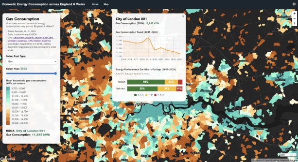
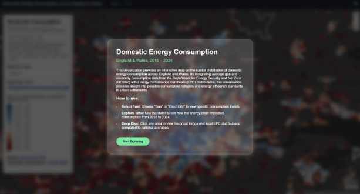
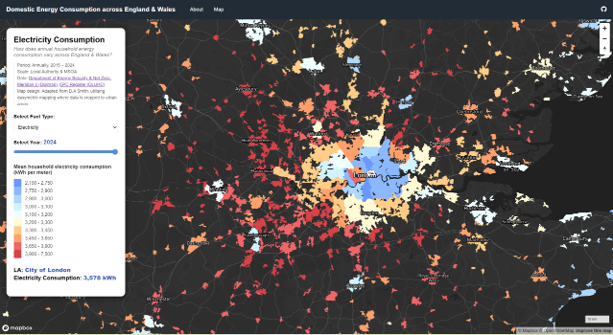

## Overview

This visualization provides an interactive map on the spatial distribution of domestic energy consumption across England and Wales (2015–2024). By integrating average gas and electricity consumption data from the [Department for Energy Security and Net Zero (DESNZ)](https://www.gov.uk/government/collections/sub-national-electricity-consumption-data) with [Energy Performance Certificate (EPC) distributions](https://get-energy-performance-data.communities.gov.uk/), this visualisation provides insight into possible consumption hotspots and energy efficiency standards in urban settlements. This adds to the discourse in urban science on local progress toward national net-zero targets and highlights areas where poor housing quality may correlate with a higher energy burden (e.g. peri-urban areas).

```{=html}
<div class="embed-scaled">
  <iframe src="https://benjamintee.github.io/CASA_UDV_Assessment/Energy_Consumption.html"
          title="Domestic energy consumption across England and Wales, 2015–2024"
          loading="lazy" allowfullscreen></iframe>
</div>
<script>
(function () {
  var W = 1200, H = 800;
  function fit() {
    document.querySelectorAll(".embed-scaled").forEach(function (w) {
      var s = w.clientWidth / W;
      w.querySelector("iframe").style.transform = "scale(" + s + ")";
      w.style.height = H * s + "px";
    });
  }
  fit();
  addEventListener("resize", fit);
})();
</script>
```

[Open full screen ↗](https://benjamintee.github.io/CASA_UDV_Assessment/Energy_Consumption.html){target="_blank"}

The map has been clipped to urban areas to show how energy consumption relates to urban geography and settlement size and calibrated to provide a national overview and distribution and at a more local scale to understand specific trends. Interactive features such as a (a) toggle between electricity and gas consumption, (b) slider to show temporal changes, and (c) point-and-click function to illustrate trends and localised energy performance, provide the user opportunities to further investigate specific data aspects. 

{fig-alt="Point-and-click function with Chart.js provides opportunities for investigation"}

## Technical Aspects

*Data preparation*

Mean energy consumption data at Middle Layer Super Output Area (MSOA) and Local Authority (LA) level from 2015 to 2024 were cleaned and joined to the latest available Census geographies for England and Wales (2021) using pandas and geopandas in Python. This timeframe was selected to provide sufficient temporal coverage for trend analysis whilst minimising data processing assumptions required to harmonise historical consumption data (pre-2015) with updated MSOA and LA boundary definitions. Similarly, data on EPC certificates from 2018-2025 were summarised for their respective MSOA and LA boundaries.  

*Data scales*

To optimize for web performance, the following steps were undertaken in QGIS: 
- Spatial Filtering: Polygons were clipped to urban boundaries using OS Meridian 2 data, focusing analysis on human settlements and settlement size (O’Brien & Cheshire, 2016). Polygon areas smaller than 1.2km2 at LA level and 0.2km2 at MSOA level were removed to focus attention while providing recognisable features.
- Generalization: Boundaries were simplified using an 80-meter tolerance to balance visual continuity with file size efficiency. 
- Performance: Final layers were reprojected to WGS84 (EPSG:4326) and converted to GeoJSON for Mapbox integration.

## Cartographic Aspects

The map was created using [Mapbox GL JS](https://docs.mapbox.com/mapbox-gl-js/guides/), with a dark-mode basemap. High luminosity data layers were used to improve contrast and retain visual hierarchy. A diverging colour scheme (tested for colour-blind accessibility) distinguishes between high and low consumption tiers, providing an intuitive sense of "energy intensity."

Interactivity was used to improve user experience and provide insights:
- Landing page: Introduces objectives and functions.
- Exploration: Users toggle between fuel types and years via UI widgets, triggering real-time filter updates.
- Feedback: High-contrast off-white highlight layer provides visual feedback on mouseover. Sidebar widget provides information on the average consumption values for the selected fuel type and year.
- Deep Dive: The point-and-click function triggers popups containing dual charts. A line chart visualizes the 10-year consumption trend, while a horizontal bar chart compares localized EPC groupings against national averages, offering a benchmark of domestic energy efficiency.

{fig-alt="Landing page to provide guiding instructions to user"}

{fig-alt="Dropdown function to toggle fuel consumption type"}

## Limitations and Future Improvements

Given limitations in functionality with the customisation of place-label colour in Mapbox Studio Standard basemap to improve contrast, an alternative basemap (Mapbox Dark v11) was chosen which allowed place labels to be brightened to improve legibility in higher-density areas. Future iterations could incorporate Ofgem price data and household income estimates to map "energy burden", the percentage of household income spent on total energy cost, providing a more direct metric for urban social justice and policy intervention.

*This article was submitted as part of my coursework for the CASA0029 Urban Data Visualisation module.*  
*Source code: [github.com/benjamintee/CASA_UDV_Assessment](https://github.com/benjamintee/CASA_UDV_Assessment)*  
*The full visualisation can be found [here](<https://benjamintee.github.io/CASA_UDV_Assessment/Energy_Consumption.html>)*

## References 

O’Brien O, Cheshire J, 2016, “Interactive mapping for large, open demographic data sets using familiar geographical features” Journal of Maps 12(4) 676–683

DLUHC (2025) Energy Performance of Buildings Data England and Wales. Available at: https://epc.opendatacommunities.org/. 

Department for Energy Security and Net Zero (2025a) Electricity and gas consumption estimates at MSOA level. Available at: https://www.gov.uk/government/collections/sub-national-electricity-consumption-data. 
